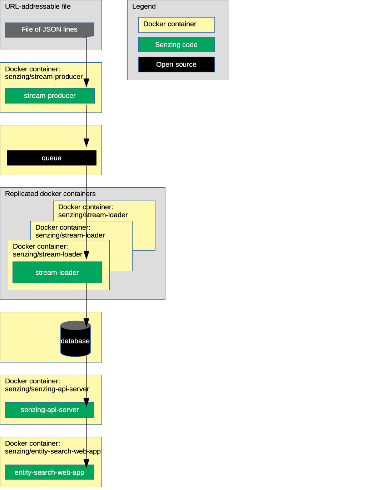

# docker-compose-demo

## Synopsis

Using `docker-compose`, bring up a Senzing stack.

## Overview

This repository illustrates reference implementations of Senzing using docker-compose.

The instructions show how to set up a system that:

1. Reads JSON lines from a file on the internet and sends each JSON line to a message queue via the Senzing
   [stream-producer](https://github.com/Senzing/stream-producer).
1. Reads messages from the queue and inserts into Senzing via the Senzing
   [stream-loader](https://github.com/Senzing/stream-loader).
1. Reads information from Senzing via [Senzing API Server](https://github.com/Senzing/senzing-api-server) server.
1. Views resolved entities in a [web app](https://github.com/Senzing/entity-search-web-app).

The following diagram shows the relationship of the docker containers in this docker composition.
Arrows represent data flow.

## Caveat

This demonstration runs on platforms that support `docker` and `docker-compose`.

:warning: RedHat has explicitly stated that
[Docker is not supported in RHEL 8](https://access.redhat.com/documentation/en-us/red_hat_enterprise_linux/8/html-single/building_running_and_managing_containers/index#con_running-containers-without-docker_assembly_starting-with-containers).
As such, these demonstrations of Senzing using `docker` and `docker-compose`
do not run in a RedHat Enterprise Linux 8 environment natively.
Likewise, `docker` is not a CentOS 8 supported project.
Although with user-modification it has been shown that docker and docker-compose can run in these environments,
the onus is on the user for proper operation of docker and docker networking.

## Implementation

The following tables indicate the instructions for variations in components.

1. Component variants:
    1. Queue
        1. RabbitMQ
        1. Kafka
        1. AWS SQS
    1. Database
        1. Postgres
        1. MySQL
        1. MS SQL
1. Implementations of the docker formation:

    | Queue    | Database       | Instructions | docker-compose.yaml |
    |----------|----------------|:------------:|---------------------|
    | RabbitMQ | PostgreSQL     | [instructions](docs/docker-compose-rabbitmq-postgresql/README.md) | [docker-compose-rabbitmq-postgresql.yaml](resources/postgresql/docker-compose-rabbitmq-postgresql.yaml) |
    | RabbitMQ | MySQL          | [instructions](docs/docker-compose-rabbitmq-mysql/README.md)      | [docker-compose-rabbitmq-mysql.yaml](resources/mysql/docker-compose-rabbitmq-mysql.yaml) |
    | RabbitMQ | MSSQL          | [instructions](docs/docker-compose-rabbitmq-mssql/README.md)      | [docker-compose-rabbitmq-mssql.yaml](resources/mssql/docker-compose-rabbitmq-mssql.yaml) |
    | Kafka    | PostgreSQL     | [instructions](docs/docker-compose-kafka-postgresql/README.md)    | [docker-compose-kafka-postgresql.yaml](resources/postgresql/docker-compose-kafka-postgresql.yaml) |
    | Kafka    | MySQL          | [instructions](docs/docker-compose-kafka-mysql/README.md)         | [docker-compose-kafka-mysql.yaml](resources/mysql/docker-compose-kafka-mysql.yaml) |
    | Kafka    | MSSQL          | [instructions](docs/docker-compose-kafka-mssql/README.md)         | [docker-compose-kafka-mssql.yaml](resources/mssql/docker-compose-kafka-mssql.yaml) |
    | AWS SQS  | PostgreSQL     | [instructions](docs/docker-compose-sqs-postgresql/README.md)      | [docker-compose-sqs-postgresql.yaml](resources/postgresql/docker-compose-sqs-postgresql.yaml) |

1. Advanced docker formations:

    | Description | Instructions |
    |-------------|:------------:|
    | Various enhancements built upon PostgreSQL and RabbitMQ. | [instructions](docs/docker-compose-rabbitmq-postgresql-advanced/README.md) |
    | Various enhancements built upon PostgreSQL and Kafka.    | [instructions](docs/docker-compose-kafka-postgresql-advanced/README.md)    |
    | Various enhancements built upon PostgreSQL and Amazon.   | [instructions](docs/docker-compose-sqs-postgresql-advanced/README.md)      |
