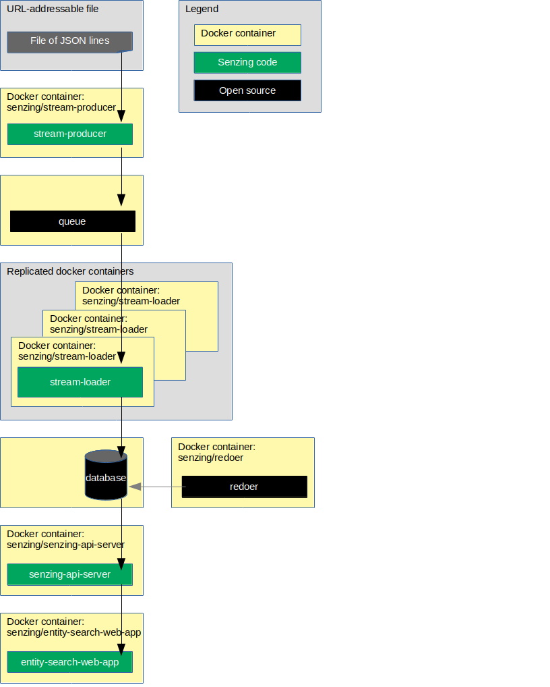

# docker-compose-demo

## Overview

This repository illustrates a reference implementations of Senzing using docker-compose.

The instructions show how to set up a system that:

1. Reads JSON lines from a file on the internet.
1. Sends each JSON line as a message to a queue.
1. Reads messages from the queue and inserts into Senzing.
1. Reads information from Senzing via [Senzing REST API](https://github.com/Senzing/senzing-rest-api) server.

The following diagram shows the relationship of the docker containers in this docker composition.

Implementations of the docker formation:

| Queue | Database | Instructions |
|-------|----------|--------------|
| Kafka | Db2 | [docker-compose-kafka-db2.yaml](docs/docker-compose-kafka-db2/README.md) |
| Kafka | MySQL | [docker-compose-kafka-mysql.yaml](docs/docker-compose-kafka-mysql/README.md) |
| Kafka | PostgreSQL | [docker-compose-kafka-postgresql.yaml](docs/docker-compose-kafka-postgresql/README.md) |
| Kafka | SQLite | [docker-compose-kafka-sqlite.yaml](docs/docker-compose-kafka-sqlite/README.md) |
| RabbitMQ | PostgreSQL | [docker-compose-rabbitmq-postgresql.yaml](docs/docker-compose-rabbitmq-postgresql/README.md) |
