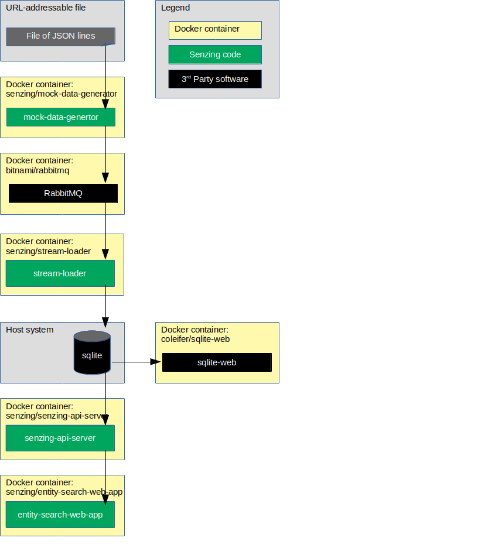

# docker-compose-getting-started

## Overview

This repository illustrates a reference implementation of Senzing using
RabbitMQ as the queue and
SQLite as the underlying database.

The instructions show how to set up a system that:

1. Reads JSON lines from a file on the internet.
1. Sends each JSON line to a message queue.
    1. In this implementation, the queue is RabbitMQ.
1. Reads messages from the queue and inserts into Senzing.
    1. In this implementation, Senzing keeps its data in a SQLite database.
1. Reads information from Senzing via [Senzing REST API](https://github.com/Senzing/senzing-rest-api) server.
1. Views resolved entities in a [web app](https://github.com/Senzing/entity-search-web-app).

The following diagram shows the relationship of the docker containers in this docker composition.
Arrows represent data flow.



This docker formation brings up the following docker containers:

1. *[bitnami/rabbitmq](https://github.com/bitnami/bitnami-docker-rabbitmq)*
1. *[coleifer/sqlite-web](https://github.com/coleifer/sqlite-web)*
1. *[senzing/debug](https://github.com/Senzing/docker-senzing-debug)*
1. *[senzing/entity-web-search-app](https://github.com/Senzing/entity-search-web-app)*
1. *[senzing/init-container](https://github.com/Senzing/docker-init-container)*
1. *[senzing/mock-data-generator](https://github.com/Senzing/mock-data-generator)*
1. *[senzing/senzing-api-server](https://github.com/Senzing/senzing-api-server)*
1. *[senzing/stream-loader](https://github.com/Senzing/stream-loader)*

### Contents

1. [Expectations](#expectations)
    1. [Space](#space)
    1. [Time](#time)
    1. [Background knowledge](#background-knowledge)
1. [Preparation](#preparation)
    1. [Prerequisite software](#prerequisite-software)
    1. [Pull docker images](#pull-docker-images)
    1. [Clone repository](#clone-repository)
1. [Using docker-compose](#using-docker-compose)
    1. [Volumes](#volumes)
    1. [EULA](#eula)
    1. [Install Senzing](#install-senzing)
    1. [Run docker formation](#run-docker-formation)
1. [View data](#view-data)
    1. [View docker containers](#view-docker-containers)
    1. [View RabbitMQ](#view-rabbitmq)
    1. [View SQLite](#view-sqlite)
    1. [View Senzing API](#view-senzing-api)
    1. [View Senzing Entity Search WebApp](#view-senzing-entity-search-webapp)
1. [Cleanup](#cleanup)
1. [Advanced](#advanced)
    1. [Re-run docker formation](#re-run-docker-formation)
    1. [Configuration](#configuration)

### Legend

1. :thinking: - A "thinker" icon means that a little extra thinking may be required.
   Perhaps you'll need to make some choices.
   Perhaps it's an optional step.
1. :pencil2: - A "pencil" icon means that the instructions may need modification before performing.
1. :warning: - A "warning" icon means that something tricky is happening, so pay attention.

## Expectations

### Space

This repository and demonstration require 7 GB free disk space.

### Time

Budget 2 hours to get the demonstration up-and-running, depending on CPU and network speeds.

### Background knowledge

This repository assumes a working knowledge of:

1. [Docker](https://github.com/Senzing/knowledge-base/blob/master/WHATIS/docker.md)
1. [Docker-compose](https://github.com/Senzing/knowledge-base/blob/master/WHATIS/docker-compose.md)

## Preparation

### Prerequisite software

The following software programs need to be installed:

1. [docker](https://github.com/Senzing/knowledge-base/blob/master/HOWTO/install-docker.md)
1. [docker-compose](https://github.com/Senzing/knowledge-base/blob/master/HOWTO/install-docker-compose.md)
1. [git](https://github.com/Senzing/knowledge-base/blob/master/HOWTO/install-git.md)

### Pull docker images

1. :thinking: **Optional:** To speed up following steps, docker images may be pulled in advance.
   Example:

    ```console
    sudo docker pull bitnami/rabbitmq:3.8.2
    sudo docker pull coleifer/sqlite-web:latest
    sudo docker pull senzing/entity-search-web-app:1.0.4
    sudo docker pull senzing/init-container:1.5.0
    sudo docker pull senzing/mock-data-generator:1.1.0
    sudo docker pull senzing/senzing-api-server:1.7.10
    sudo docker pull senzing/senzing-debug:1.3.0
    sudo docker pull senzing/stream-loader:1.4.0
    sudo docker pull senzing/yum:1.1.3
    ```

### Clone repository

For more information on environment variables,
see [Environment Variables](https://github.com/Senzing/knowledge-base/blob/master/lists/environment-variables.md).

1. Set these environment variable values:

    ```console
    export GIT_ACCOUNT=senzing
    export GIT_REPOSITORY=docker-compose-demo
    export GIT_ACCOUNT_DIR=~/${GIT_ACCOUNT}.git
    export GIT_REPOSITORY_DIR="${GIT_ACCOUNT_DIR}/${GIT_REPOSITORY}"
    ```

1. Follow steps in [clone-repository](https://github.com/Senzing/knowledge-base/blob/master/HOWTO/clone-repository.md) to install the Git repository.

## Using docker-compose

### Volumes

1. :pencil2: Specify the directory where Senzing should be installed on the local host.
   Example:

    ```console
    export SENZING_VOLUME=/opt/my-senzing
    ```

    1. :warning:
       **macOS** - [File sharing](https://github.com/Senzing/knowledge-base/blob/master/HOWTO/share-directories-with-docker.md#macos)
       must be enabled for `SENZING_VOLUME`.
    1. :warning:
       **Windows** - [File sharing](https://github.com/Senzing/knowledge-base/blob/master/HOWTO/share-directories-with-docker.md#windows)
       must be enabled for `SENZING_VOLUME`.

1. Identify directories on the local host.
   Example:

    ```console
    export SENZING_DATA_DIR=${SENZING_VOLUME}/data
    export SENZING_DATA_VERSION_DIR=${SENZING_DATA_DIR}/1.0.0
    export SENZING_ETC_DIR=${SENZING_VOLUME}/etc
    export SENZING_G2_DIR=${SENZING_VOLUME}/g2
    export SENZING_VAR_DIR=${SENZING_VOLUME}/var
    ```

### EULA

To use the Senzing code, you must agree to the End User License Agreement (EULA).

1. :warning: This step is intentionally tricky and not simply copy/paste.
   This ensures that you make a conscious effort to accept the EULA.
   Example:

    <code>export SENZING_ACCEPT_EULA="&lt;the value from [this link](https://github.com/Senzing/knowledge-base/blob/master/lists/environment-variables.md#senzing_accept_eula)&gt;"</code>

### Install Senzing

1. If Senzing has not been installed, install Senzing.
   Example:

    ```console
    cd ${GIT_REPOSITORY_DIR}
    sudo \
      --preserve-env \
      docker-compose --file resources/senzing/docker-compose-senzing-installation.yaml up
    ```

### Run docker formation

1. Launch docker-compose formation.
   Example:

    ```console
    cd ${GIT_REPOSITORY_DIR}
    sudo \
      --preserve-env \
      docker-compose --file resources/sqlite/docker-compose-getting-started.yaml up
    ```

1. Allow time for the components to come up and initialize.

## View data

Once the docker-compose formation is running,
different aspects of the formation can be viewed.

Username and password for the following sites were either passed in as environment variables
or are the default values seen in
[docker-compose-getting-started.yaml](../../resources/sqlite/docker-compose-getting-started.yaml).

### View docker containers

1. A good tool to monitor individual docker logs is
   [Portainer](https://github.com/Senzing/knowledge-base/blob/master/WHATIS/portainer.md).
   When running, Portainer is viewable at
   [localhost:9170](http://localhost:9170).

### View RabbitMQ

1. RabbitMQ is viewable at
   [localhost:15672](http://localhost:15672).
    1. **Defaults:** username: `user` password: `bitnami`
1. See
   [additional tips](https://github.com/Senzing/knowledge-base/blob/master/lists/docker-compose-demo-tips.md#rabbitmq)
   for working with RabbitMQ.

### View SQLite

1. SQLite is viewable at
   [localhost:9174](http://localhost:9174).
1. See
   [additional tips](https://github.com/Senzing/knowledge-base/blob/master/lists/docker-compose-demo-tips.md#sqlite)
   for working with SQLite.

### View Senzing API

View results from Senzing REST API server.
The server supports the
[Senzing REST API](https://github.com/Senzing/senzing-rest-api).

1. Example Senzing REST API request:
   [localhost:8250/heartbeat](http://localhost:8250/heartbeat)
1. See
   [additional tips](https://github.com/Senzing/knowledge-base/blob/master/lists/docker-compose-demo-tips.md#senzing-api-server)
   for working with Senzing API server.

### View Senzing Entity Search WebApp

1. Senzing Entity Search WebApp is viewable at
   [localhost:8251](http://localhost:8251).
1. See
   [additional tips](https://github.com/Senzing/knowledge-base/blob/master/lists/docker-compose-demo-tips.md#senzing-entity-search-webapp)
   for working with Senzing Entity Search WebApp.

## Cleanup

When the docker-compose formation is no longer needed,
it can be brought down and directories can be deleted.

1. Bring down docker formation.
   Example:

    ```console
    cd ${GIT_REPOSITORY_DIR}
    sudo docker-compose --file resources/senzing/docker-compose-senzing-installation.yaml down
    sudo docker-compose --file resources/sqlite/docker-compose-getting-started.yaml down
    ```

1. Remove directories from host system.
   The following directories were created during the demonstration:
    1. `${SENZING_VOLUME}`
    1. `${GIT_REPOSITORY_DIR}`
   They may be safely deleted.

## Advanced

The following topics discuss variations to the basic docker-compose demonstration.

### Configuration

Configuration values specified by environment variable or command line parameter.

- **[SENZING_ACCEPT_EULA](https://github.com/Senzing/knowledge-base/blob/master/lists/environment-variables.md#senzing_accept_eula)**
- **[SENZING_DATA_DIR](https://github.com/Senzing/knowledge-base/blob/master/lists/environment-variables.md#senzing_data_dir)**
- **[SENZING_DATA_VERSION_DIR](https://github.com/Senzing/knowledge-base/blob/master/lists/environment-variables.md#senzing_data_version_dir)**
- **[SENZING_ETC_DIR](https://github.com/Senzing/knowledge-base/blob/master/lists/environment-variables.md#senzing_etc_dir)**
- **[SENZING_G2_DIR](https://github.com/Senzing/knowledge-base/blob/master/lists/environment-variables.md#senzing_g2_dir)**
- **[SENZING_VAR_DIR](https://github.com/Senzing/knowledge-base/blob/master/lists/environment-variables.md#senzing_var_dir)**

