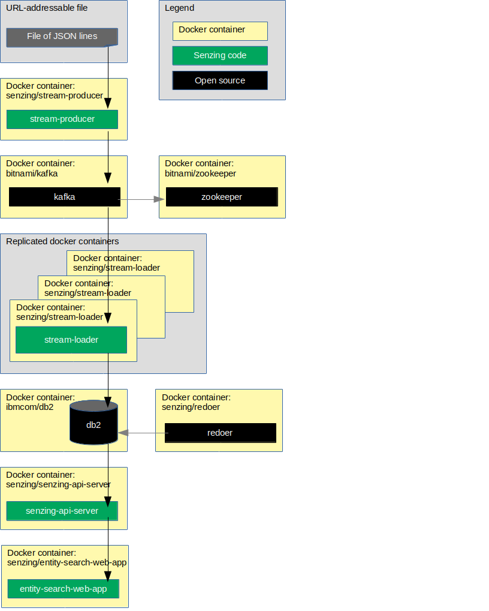

# docker-compose-kafka-db2

## Overview

This repository illustrates a reference implementation of Senzing using
Kafka as the queue and
Db2 as the underlying database.

The instructions show how to set up a system that:

1. Reads JSON lines from a file on the internet.
1. Sends each JSON line to a message queue.
    1. In this implementation, the queue is Kafka.
1. Reads messages from the queue and inserts into Senzing.
    1. In this implementation, Senzing keeps its data in a Db2 database.
1. Reads information from Senzing via [Senzing REST API](https://github.com/Senzing/senzing-rest-api) server.

The following diagram shows the relationship of the docker containers in this docker composition.



This docker formation brings up the following docker containers:

1. *[bitnami/zookeeper](https://github.com/bitnami/bitnami-docker-zookeeper)*
1. *[bitnami/kafka](https://github.com/bitnami/bitnami-docker-kafka)*
1. *[senzing/db2express-c](https://github.com/Senzing/docker-db2express-c)*
1. *[senzing/mock-data-generator](https://github.com/Senzing/mock-data-generator)*
1. *[senzing/senzing-base](https://github.com/Senzing/docker-senzing-base)*
1. *[senzing/stream-loader](https://github.com/Senzing/stream-loader)*
1. *[senzing/senzing-api-server](https://github.com/Senzing/senzing-api-server)*

### Contents

1. [Expectations](#expectations)
    1. [Space](#space)
    1. [Time](#time)
    1. [Background knowledge](#background-knowledge)
1. [Preparation](#preparation)
    1. [Prerequisite software](#prerequisite-software)
    1. [Clone repository](#clone-repository)
    1. [EULA](#eula)
1. [Using docker-compose](#using-docker-compose)
    1. [Build docker images](#build-docker-images)
    1. [Configuration](#configuration)
    1. [Volumes](#volumes)
    1. [Run docker formation](#run-docker-formation)
    1. [Initialize database](#initialize-database)
    1. [Test Senzing API](#test-senzing-api)
1. [Cleanup](#cleanup)

## Expectations

### Space

This repository and demonstration require 7 GB free disk space.

### Time

Budget 2 hours to get the demonstration up-and-running, depending on CPU and network speeds.

### Background knowledge

This repository assumes a working knowledge of:

1. [Docker](https://github.com/Senzing/knowledge-base/blob/master/WHATIS/docker.md)
1. [Docker-compose](https://github.com/Senzing/knowledge-base/blob/master/WHATIS/docker-compose.md)

## Preparation

### Prerequisite software

The following software programs need to be installed:

1. [docker](https://github.com/Senzing/knowledge-base/blob/master/HOWTO/install-docker.md)
1. [docker-compose](https://github.com/Senzing/knowledge-base/blob/master/HOWTO/install-docker-compose.md)

### Clone repository

For more information on environment variables,
see [Environment Variables](https://github.com/Senzing/knowledge-base/blob/master/lists/environment-variables.md).

1. Set these environment variable values:

    ```console
    export GIT_ACCOUNT=senzing
    export GIT_REPOSITORY=docker-compose-demo
    ```

1. Follow steps in [clone-repository](https://github.com/Senzing/knowledge-base/blob/master/HOWTO/clone-repository.md) to install the Git repository.

1. After the repository has been cloned, be sure the following are set:

    ```console
    export GIT_ACCOUNT_DIR=~/${GIT_ACCOUNT}.git
    export GIT_REPOSITORY_DIR="${GIT_ACCOUNT_DIR}/${GIT_REPOSITORY}"
    ```

### EULA

To use the Senzing code, you must agree to the End User License Agreement (EULA).

1. :warning: This step is intentionally tricky and not simply copy/paste.
   This ensures that you make a conscious effort to accept the EULA.
   See
   [SENZING_ACCEPT_EULA](https://github.com/Senzing/knowledge-base/blob/master/lists/environment-variables.md#senzing_accept_eula)
   for the correct value.
   Replace the double-quote character in the example with the correct value.
   The use of the double-quote character is intentional to prevent simple copy/paste.
   Example:

    ```console
    export SENZING_ACCEPT_EULA="
    ```

## Using docker-compose

### Build docker images

1. Build docker images.

    ```console
    sudo docker build \
      --tag senzing/db2express-c \
      https://github.com/senzing/docker-db2express-c.git
    ```

### Configuration

- **[DB2_DB](https://github.com/Senzing/knowledge-base/blob/master/lists/environment-variables.md#db2_db)**
- **[DB2_PASSWORD](https://github.com/Senzing/knowledge-base/blob/master/lists/environment-variables.md#db2_password)**
- **[DB2_STORAGE](https://github.com/Senzing/knowledge-base/blob/master/lists/environment-variables.md#db2_storage)**
- **[DB2_USERNAME](https://github.com/Senzing/knowledge-base/blob/master/lists/environment-variables.md#db2_username)**
- **[DB2INST1_PASSWORD](https://github.com/Senzing/knowledge-base/blob/master/lists/environment-variables.md#db2inst_password)**
- **[SENZING_ACCEPT_EULA](https://github.com/Senzing/knowledge-base/blob/master/lists/environment-variables.md#senzing_accept_eula)**
- **[SENZING_DATA_VERSION_DIR](https://github.com/Senzing/knowledge-base/blob/master/lists/environment-variables.md#senzing_data_version_dir)**
- **[SENZING_ETC_DIR](https://github.com/Senzing/knowledge-base/blob/master/lists/environment-variables.md#senzing_etc_dir)**
- **[SENZING_G2_DIR](https://github.com/Senzing/knowledge-base/blob/master/lists/environment-variables.md#senzing_g2_dir)**
- **[SENZING_IBM_DIR](https://github.com/Senzing/knowledge-base/blob/master/lists/environment-variables.md#senzing_ibm_dir)**

### Volumes

The output of `yum install senzingapi` placed files in different directories.
Create a folder for each output directory.

1. :pencil2: Option #1.
   To mimic an actual RPM installation,
   identify directories for RPM output in this manner:

    ```console
    export SENZING_DATA_DIR=/opt/senzing/data
    export SENZING_DATA_VERSION_DIR=${SENZING_DATA_DIR}/1.0.0
    export SENZING_ETC_DIR=/etc/opt/senzing
    export SENZING_G2_DIR=/opt/senzing/g2
    export SENZING_IBM_DIR=/opt/IBM
    ```

1. :pencil2: Option #2.
   If Senzing directories were put in alternative directories,
   set environment variables to reflect where the directories were placed.
   Example:

    ```console
    export SENZING_VOLUME=/opt/my-senzing

    export SENZING_DATA_DIR=${SENZING_VOLUME}/data
    export SENZING_DATA_VERSION_DIR=${SENZING_DATA_DIR}/1.0.0
    export SENZING_ETC_DIR=${SENZING_VOLUME}/etc
    export SENZING_G2_DIR=${SENZING_VOLUME}/g2
    export SENZING_IBM_DIR=${SENZING_VOLUME}/IBM
    ```

### Run docker formation

1. If Senzing has not been installed, install Senzing.
   Example:

    ```console
    cd ${GIT_REPOSITORY_DIR}
    sudo \
      SENZING_ACCEPT_EULA=${SENZING_ACCEPT_EULA} \
      SENZING_DATA_DIR=${SENZING_DATA_DIR} \
      SENZING_ETC_DIR=${SENZING_ETC_DIR} \
      SENZING_G2_DIR=${SENZING_G2_DIR} \
      docker-compose --file docker-compose-senzing-installation.yaml up
    ```

1. Bring down Senzing installer.
   Example:

    ```console
    cd ${GIT_REPOSITORY_DIR}
    sudo docker-compose --file docker-compose-senzing-installation.yaml down
    ```

1. :pencil2: Set environment variables.
   Example:

    ```console
    export DB2_DB=G2
    export DB2_PASSWORD=db2inst1
    export DB2_STORAGE=/storage/docker/senzing/docker-compose-kafka-db2/db2
    export DB2_USERNAME=db2inst1
    export DB2INST1_PASSWORD=db2inst1
    ```

1. Initialize database and Senzing.
   Example:

    ```console
    cd ${GIT_REPOSITORY_DIR}
    sudo \
      DB2_DB=${DB2_DB} \
      DB2_PASSWORD=${DB2_PASSWORD} \
      DB2_STORAGE=${DB2_STORAGE} \
      DB2_USERNAME=${DB2_USERNAME} \
      DB2INST1_PASSWORD=${DB2INST1_PASSWORD} \
      SENZING_DATA_VERSION_DIR=${SENZING_DATA_VERSION_DIR} \
      SENZING_ETC_DIR=${SENZING_ETC_DIR} \
      SENZING_G2_DIR=${SENZING_G2_DIR} \
      SENZING_IBM_DIR=${SENZING_IBM_DIR} \
      docker-compose --file docker-compose-db2-initialization.yaml up
    ```

1. Bring down database initialization.
   Example:

    ```console
    cd ${GIT_REPOSITORY_DIR}
    sudo docker-compose --file docker-compose-db2-initialization.yaml down
    ```

1. Launch docker-compose formation.
   Example:

    ```console
    cd ${GIT_REPOSITORY_DIR}
    sudo \
      DB2_DB=${DB2_DB} \
      DB2_PASSWORD=${DB2_PASSWORD} \
      DB2_STORAGE=${DB2_STORAGE} \
      DB2_USERNAME=${DB2_USERNAME} \
      DB2INST1_PASSWORD=${DB2INST1_PASSWORD} \
      SENZING_DATA_VERSION_DIR=${SENZING_DATA_VERSION_DIR} \
      SENZING_ETC_DIR=${SENZING_ETC_DIR} \
      SENZING_G2_DIR=${SENZING_G2_DIR} \
      SENZING_IBM_DIR=${SENZING_IBM_DIR} \
      docker-compose --file docker-compose-kafka-db2.yaml up
    ```

### Initialize database

1. Enter `senzing-db2`container.
   Example:

    ```console
    sudo docker exec \
      --interactive \
      --tty \
      senzing-db2 /bin/bash
    ```

1. Populate database.
   In `senzing-db2` docker container, run:

    ```console
    su - db2inst1
    db2 create database g2 using codeset utf-8 territory us
    db2 connect to g2
    db2 -tf /opt/senzing/g2/data/g2core-schema-db2-create.sql | tee /tmp/g2schema.out
    db2 connect reset
    exit
    exit
    ```

### Test Senzing API

1. Wait for the following message in the terminal showing docker log.

    ```console
    senzing-api-server | Started Senzing REST API Server on port 8080.
    senzing-api-server |
    senzing-api-server | Server running at:
    senzing-api-server | http://0.0.0.0:8080/
    ```

1. Test Senzing REST API server.
   *Note:*  In
   [docker-compose-kafka-db2.yaml](../../docker-compose-kafka-db2.yaml)
   port 8889 on the localhost has been mapped to port 8080 in the docker container.
   Example:

    ```console
    export SENZING_API_SERVICE=http://localhost:8889

    curl -X GET ${SENZING_API_SERVICE}/heartbeat
    curl -X GET ${SENZING_API_SERVICE}/license
    curl -X GET ${SENZING_API_SERVICE}/entities/1
    ```

## Cleanup

In a separate (or reusable) terminal window:

1. Use environment variable describe in "[Clone repository](#clone-repository)" and "[Configuration](#configuration)".
1. Run `docker-compose` command.

    ```console
    cd ${GIT_REPOSITORY_DIR}
    sudo docker-compose --file docker-compose-kafka-db2.yaml down
    ```

1. Delete storage.

    ```console
    sudo rm -rf ${DB2_STORAGE}
    ```

1. Delete SENZING_DIR.

    ```console
    sudo rm -rf ${SENZING_DIR}
    ```

1. Delete git repository.

    ```console
    sudo rm -rf ${GIT_REPOSITORY_DIR}
    ```
