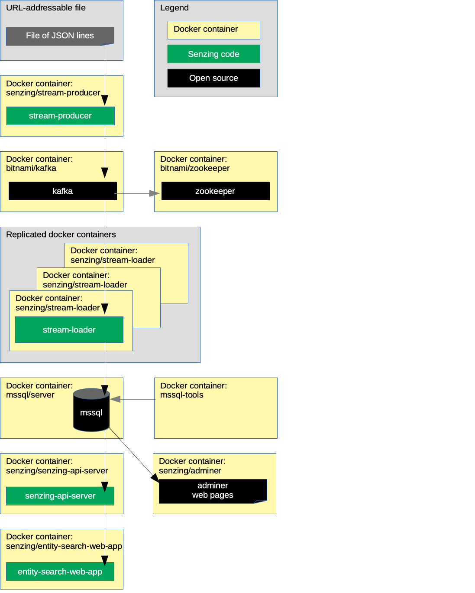

# docker-compose-kafka-mssql

## Overview

This repository illustrates a reference implementation of Senzing using
Kafka as the queue and
MSSQL as the underlying database.

The instructions show how to set up a system that:

1. Reads JSON lines from a file on the internet.
1. Sends each JSON line to a message queue.
    1. In this implementation, the queue is Kafka.
1. Reads messages from the queue and inserts into Senzing.
    1. In this implementation, Senzing keeps its data in a MSSQL database.
1. Reads information from Senzing via [Senzing REST API](https://github.com/Senzing/senzing-rest-api) server.
1. Views resolved entities in a [web app](https://github.com/Senzing/entity-search-web-app).

The following diagram shows the relationship of the docker containers in this docker composition.
Arrows represent data flow.



This docker formation brings up the following docker containers:

1. *[bitnami/kafka](https://github.com/bitnami/bitnami-docker-kafka)*
1. *[bitnami/zookeeper](https://github.com/bitnami/bitnami-docker-zookeeper)*
1. *[mcr.microsoft.com/mssql/server:2019-GA-ubuntu-16.04](https://github.com/Microsoft/mssql-docker)*
1. *[mcr.microsoft.com/mssql-tools](https://github.com/Microsoft/mssql-docker)*
1. *[senzing/adminer](https://github.com/Senzing/docker-adminer)*
1. *[senzing/debug](https://github.com/Senzing/docker-senzing-debug)*
1. *[senzing/entity-web-search-app](https://github.com/Senzing/entity-search-web-app)*
1. *[senzing/init-container](https://github.com/Senzing/docker-init-container)*
1. *[senzing/mock-data-generator](https://github.com/Senzing/mock-data-generator)*
1. *[senzing/senzing-api-server](https://github.com/Senzing/senzing-api-server)*
1. *[senzing/stream-loader](https://github.com/Senzing/stream-loader)*

### Contents

1. [Expectations](#expectations)
    1. [Space](#space)
    1. [Time](#time)
    1. [Background knowledge](#background-knowledge)
1. [Preparation](#preparation)
    1. [Prerequisite software](#prerequisite-software)
    1. [Pull docker images](#pull-docker-images)
    1. [Clone repository](#clone-repository)
1. [Using docker-compose](#using-docker-compose)
    1. [Configuration](#configuration)
    1. [Volumes](#volumes)
    1. [EULA](#eula)
    1. [Install Senzing](#install-senzing)
    1. [Install Senzing license](#install-senzing-license)
    1. [Install MS SQL driver](#install-ms-sql-driver)
    1. [Run docker formation](#run-docker-formation)
1. [View data](#view-data)
    1. [View docker containers](#view-docker-containers)
    1. [View Kafka](#view-kafka)
    1. [View MSSQL](#view-mssql)
    1. [View Senzing API](#view-senzing-api)
    1. [View Senzing Entity Search WebApp](#view-senzing-entity-search-webapp)
1. [Cleanup](#cleanup)
1. [Re-run docker formation](#re-run-docker-formation)
1. [Notes](#notes)
    1. [Running non-root](#running-non-root)

### Legend

1. :thinking: - A "thinker" icon means that a little extra thinking may be required.
   Perhaps you'll need to make some choices.
   Perhaps it's an optional step.
1. :pencil2: - A "pencil" icon means that the instructions may need modification before performing.
1. :warning: - A "warning" icon means that something tricky is happening, so pay attention.

## Expectations

### Space

This repository and demonstration require 7 GB free disk space.

### Time

Budget 2 hours to get the demonstration up-and-running, depending on CPU and network speeds.

### Background knowledge

This repository assumes a working knowledge of:

1. [Docker](https://github.com/Senzing/knowledge-base/blob/master/WHATIS/docker.md)
1. [Docker-compose](https://github.com/Senzing/knowledge-base/blob/master/WHATIS/docker-compose.md)

## Preparation

### Prerequisite software

The following software programs need to be installed:

1. [docker](https://github.com/Senzing/knowledge-base/blob/master/HOWTO/install-docker.md)
1. [docker-compose](https://github.com/Senzing/knowledge-base/blob/master/HOWTO/install-docker-compose.md)
1. [git](https://github.com/Senzing/knowledge-base/blob/master/HOWTO/install-git.md)

### Pull docker images

1. :thinking: **Optional:** To speed up following steps, docker images may be pulled in advance.
   Example:

    ```console
    sudo docker pull bitnami/kafka:2.4.0
    sudo docker pull bitnami/zookeeper:3.5.6
    sudo docker pull kafkamanager/kafka-manager:2.0.0.2
    sudo docker pull mcr.microsoft.com/mssql/server:2019-GA-ubuntu-16.04
    sudo docker pull mcr.microsoft.com/mssql-tools
    sudo docker pull senzing/adminer:1.0.0
    sudo docker pull senzing/apt:1.0.3
    sudo docker pull senzing/entity-search-web-app:1.0.4
    sudo docker pull senzing/init-container:1.5.0
    sudo docker pull senzing/mock-data-generator:1.1.0
    sudo docker pull senzing/senzing-api-server:1.7.10
    sudo docker pull senzing/senzing-debug:1.3.0
    sudo docker pull senzing/stream-loader:1.4.0
    sudo docker pull senzing/yum:1.1.3
    ```

### Clone repository

For more information on environment variables,
see [Environment Variables](https://github.com/Senzing/knowledge-base/blob/master/lists/environment-variables.md).

1. Set these environment variable values:

    ```console
    export GIT_ACCOUNT=senzing
    export GIT_REPOSITORY=docker-compose-demo
    export GIT_ACCOUNT_DIR=~/${GIT_ACCOUNT}.git
    export GIT_REPOSITORY_DIR="${GIT_ACCOUNT_DIR}/${GIT_REPOSITORY}"
    ```

1. Follow steps in [clone-repository](https://github.com/Senzing/knowledge-base/blob/master/HOWTO/clone-repository.md) to install the Git repository.

## Using docker-compose

### Configuration

Configuration values specified by environment variable or command line parameter.

- **[MSSQL_DATABASE](https://github.com/Senzing/knowledge-base/blob/master/lists/environment-variables.md#mssql_database)**
- **[MSSQL_DIR](https://github.com/Senzing/knowledge-base/blob/master/lists/environment-variables.md#mssql_dir)**
- **[MSSQL_PASSWORD](https://github.com/Senzing/knowledge-base/blob/master/lists/environment-variables.md#mssql_passwrod)**
- **[MSSQL_ROOT_PASSWORD](https://github.com/Senzing/knowledge-base/blob/master/lists/environment-variables.md#mssql_root-password)**
- **[MSSQL_USERNAME](https://github.com/Senzing/knowledge-base/blob/master/lists/environment-variables.md#mssql_username)**
- **[SENZING_ACCEPT_EULA](https://github.com/Senzing/knowledge-base/blob/master/lists/environment-variables.md#senzing_accept_eula)**
- **[SENZING_DATA_DIR](https://github.com/Senzing/knowledge-base/blob/master/lists/environment-variables.md#senzing_data_dir)**
- **[SENZING_DATA_SOURCE](https://github.com/Senzing/knowledge-base/blob/master/lists/environment-variables.md#senzing_data_source)**
- **[SENZING_DATA_VERSION_DIR](https://github.com/Senzing/knowledge-base/blob/master/lists/environment-variables.md#senzing_data_version_dir)**
- **[SENZING_ENTITY_TYPE](https://github.com/Senzing/knowledge-base/blob/master/lists/environment-variables.md#senzing_entity_type)**
- **[SENZING_ETC_DIR](https://github.com/Senzing/knowledge-base/blob/master/lists/environment-variables.md#senzing_etc_dir)**
- **[SENZING_G2_DIR](https://github.com/Senzing/knowledge-base/blob/master/lists/environment-variables.md#senzing_g2_dir)**
- **[SENZING_OPT_MICROSOFT_DIR](https://github.com/Senzing/knowledge-base/blob/master/lists/environment-variables.md#senzing_opt_microsoft_dir)**
- **[SENZING_VAR_DIR](https://github.com/Senzing/knowledge-base/blob/master/lists/environment-variables.md#senzing_var_dir)**

### Volumes

1. :pencil2: Specify the directory where Senzing should be installed on the local host.
   Example:

    ```console
    export SENZING_VOLUME=/opt/my-senzing
    ```

    1. :warning:
       **macOS** - [File sharing](https://github.com/Senzing/knowledge-base/blob/master/HOWTO/share-directories-with-docker.md#macos)
       must be enabled for `SENZING_VOLUME`.
    1. :warning:
       **Windows** - [File sharing](https://github.com/Senzing/knowledge-base/blob/master/HOWTO/share-directories-with-docker.md#windows)
       must be enabled for `SENZING_VOLUME`.

1. Identify directories on the local host.
   Example:

    ```console
    export SENZING_DATA_DIR=${SENZING_VOLUME}/data
    export SENZING_DATA_VERSION_DIR=${SENZING_DATA_DIR}/1.0.0
    export SENZING_ETC_DIR=${SENZING_VOLUME}/etc
    export SENZING_G2_DIR=${SENZING_VOLUME}/g2
    export SENZING_OPT_MICROSOFT_DIR=${SENZING_VOLUME}/opt-microsoft
    export SENZING_VAR_DIR=${SENZING_VOLUME}/var

    export MSSQL_DIR=${SENZING_VAR_DIR}/mssql
    ```

### EULA

To use the Senzing code, you must agree to the End User License Agreement (EULA).

1. :warning: This step is intentionally tricky and not simply copy/paste.
   This ensures that you make a conscious effort to accept the EULA.
   See
   [SENZING_ACCEPT_EULA](https://github.com/Senzing/knowledge-base/blob/master/lists/environment-variables.md#senzing_accept_eula)
   for the correct value.
   Replace the double-quote character in the example with the correct value.
   The use of the double-quote character is intentional to prevent simple copy/paste.
   Example:

    ```console
    export SENZING_ACCEPT_EULA="
    ```

### Install Senzing

1. If Senzing has not been installed, install Senzing.
   Example:

    ```console
    cd ${GIT_REPOSITORY_DIR}
    sudo \
      SENZING_ACCEPT_EULA=${SENZING_ACCEPT_EULA} \
      SENZING_DATA_DIR=${SENZING_DATA_DIR} \
      SENZING_ETC_DIR=${SENZING_ETC_DIR} \
      SENZING_G2_DIR=${SENZING_G2_DIR} \
      SENZING_VAR_DIR=${SENZING_VAR_DIR} \
      docker-compose --file resources/senzing/docker-compose-senzing-installation.yaml up
    ```

### Install Senzing license

:thinking: **Optional:**
Senzing comes with a trial license that supports 10,000 records.
If this is sufficient, there is no need to install a new license
and this step may be skipped.

1. If working with more than 10,000 records,
   [obtain a Senzing license](https://github.com/Senzing/knowledge-base/blob/master/HOWTO/obtain-senzing-license.md).

1. :pencil2: Identify location of `g2.lic` on local workstation.
   Example:

    ```console
    export G2_LICENSE_PATH=/path/to/local/g2.lic
    ```

1. Copy license to volume.
   Example:

    ```console
    sudo cp ${G2_LICENSE_PATH} ${SENZING_ETC_DIR}/g2.lic
    ```

### Install MS SQL driver

1. Install MS SQL driver and initialize files.
   Example:

    ```console
    cd ${GIT_REPOSITORY_DIR}
    sudo \
      MSSQL_DIR=${MSSQL_DIR} \
      SENZING_DATA_DIR=${SENZING_DATA_DIR} \
      SENZING_ETC_DIR=${SENZING_ETC_DIR} \
      SENZING_G2_DIR=${SENZING_G2_DIR} \
      SENZING_OPT_MICROSOFT_DIR=${SENZING_OPT_MICROSOFT_DIR} \
      docker-compose --file resources/mssql/docker-compose-mssql-driver.yaml up
    ```

1. Wait until completion.

1. Change directory permissions.
   **Note:** Although the `MSSQL_DIR` directory will have open permissions,
   the directories created within `MSSQL_DIR` will be restricted.
   Example:

    ```console
    sudo chmod 777 ${MSSQL_DIR}
    ```

### Run docker formation

1. Launch docker-compose formation.
   Example:

    ```console
    cd ${GIT_REPOSITORY_DIR}
    sudo \
      MSSQL_DIR=${MSSQL_DIR} \
      SENZING_DATA_VERSION_DIR=${SENZING_DATA_VERSION_DIR} \
      SENZING_ETC_DIR=${SENZING_ETC_DIR} \
      SENZING_G2_DIR=${SENZING_G2_DIR} \
      SENZING_OPT_MICROSOFT_DIR=${SENZING_OPT_MICROSOFT_DIR} \
      SENZING_VAR_DIR=${SENZING_VAR_DIR} \
      docker-compose --file resources/mssql/docker-compose-kafka-mssql.yaml up
    ```

1. Allow time for the components to come up and initialize.

## View data

1. Username and password for the following sites were either passed in as environment variables
   or are the default values seen in
   [docker-compose-kafka-mssql.yaml](../../resources/mssql/docker-compose-kafka-mssql.yaml).

### View docker containers

1. A good tool to monitor individual docker logs is
   [Portainer](https://github.com/Senzing/knowledge-base/blob/master/WHATIS/portainer.md).
   When running, Portainer is viewable at
   [localhost:9170](http://localhost:9170).

### View Kafka

1. Kafka is viewable at
   [localhost:9175](http://localhost:9175).

### View MSSQL

1. MSSQL is viewable at
   [localhost:9177](http://localhost:9177).
    1. **System:** MS SQL (beta)
    1. **Server:** senzing-mysql
    1. **Username:** sa
    1. **Password:** Passw0rd
    1. **Database:** G2
1. The records received from the queue can be viewed in the following Senzing tables:
    1. `DSRC_RECORD`
    1. `OBS_ENT`

### View Senzing API

1. View results from Senzing REST API server.
   The server supports the
   [Senzing REST API](https://github.com/Senzing/senzing-rest-api).

   1. From a web browser.
      Examples:
      1. [localhost:8250/heartbeat](http://localhost:8250/heartbeat)
      1. [localhost:8250/license](http://localhost:8250/license)
      1. [localhost:8250/entities/1](http://localhost:8250/entities/1)
   1. From `curl`.
      Examples:

        ```console
        export SENZING_API_SERVICE=http://localhost:8250

        curl -X GET ${SENZING_API_SERVICE}/heartbeat
        curl -X GET ${SENZING_API_SERVICE}/license
        curl -X GET ${SENZING_API_SERVICE}/entities/1
        ```

   1. From [OpenApi "Swagger" editor](http://editor.swagger.io/?url=https://raw.githubusercontent.com/Senzing/senzing-rest-api/master/senzing-rest-api.yaml).

### View Senzing Entity Search WebApp

1. Senzing Entity Search WebApp is viewable at
   [localhost:8251](http://localhost:8251).

1. The [demonstration](https://github.com/Senzing/knowledge-base/blob/master/demonstrations/docker-compose-web-app.md)
   instructions will give a tour of the Senzing web app.

## Cleanup

In a separate (or reusable) terminal window:

1. Use environment variable describe in "[Clone repository](#clone-repository)" and "[Configuration](#configuration)".
1. Run `docker-compose` command.

    ```console
    cd ${GIT_REPOSITORY_DIR}
    sudo docker-compose --file resources/senzing/docker-compose-senzing-installation.yaml down
    sudo docker-compose --file resources/mssql/docker-compose-mssql-driver.yaml down
    sudo docker-compose --file resources/mssql/docker-compose-kafka-mssql.yaml down
    sudo docker-compose --file resources/mssql/docker-compose-kafka-mssql-again.yaml down
    ```

1. Delete Senzing installation.
   Example:

    ```console
    sudo rm -ri ${SENZING_VOLUME}
    ```

1. Delete git repository.
   Example:

    ```console
    sudo rm -ri ${GIT_REPOSITORY_DIR}
    ```

## Re-run docker formation

:thinking: **Optional:** After the launch and shutdown of the original docker formation,
the docker formation can be brought up again without requiring initialization steps.
The following shows how to bring up the prior docker formation again without initialization.

1. Launch docker-compose formation.
   Example:

    ```console
    cd ${GIT_REPOSITORY_DIR}
    sudo \
      MSSQL_DIR=${MSSQL_DIR} \
      SENZING_DATA_VERSION_DIR=${SENZING_DATA_VERSION_DIR} \
      SENZING_ETC_DIR=${SENZING_ETC_DIR} \
      SENZING_G2_DIR=${SENZING_G2_DIR} \
      SENZING_OPT_MICROSOFT_DIR=${SENZING_OPT_MICROSOFT_DIR} \
      docker-compose --file resources/mssql/docker-compose-kafka-mssql-again.yaml up
    ```

## Notes

### Running non-root

1. The `senzing/stream-loader` and `senzing/senzing-api-server` containers are run under user `nobody` (65534).
   The reason for this is that a UID need to be selected that has a "home" directory when using ODBC.
   Rather than "hard-coding" docker images with a specific userid, an existing non-root userid is used.
   This is a known issue:
    1. [github.com/microsoft/mssql-docker/issues/431](https://github.com/microsoft/mssql-docker/issues/431).
1. The practice of "hard-coding" docker images with a specific userid, specifically the use of `useradd`,
   are problematic with system like OpenShift which determine the UID of a docker container based on the project.
   See [OpenShift: Why do my applications run as a random user ID?](https://cookbook.openshift.org/users-and-role-based-access-control/why-do-my-applications-run-as-a-random-user-id.html)
