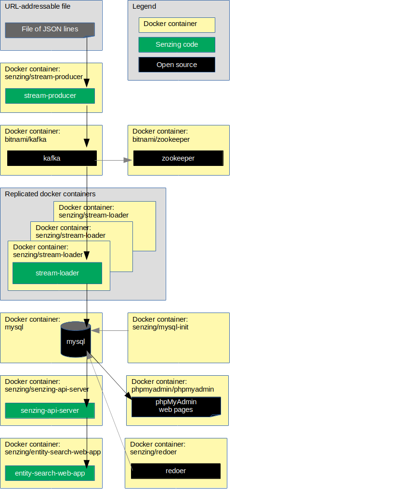

# docker-compose-kafka-mysql

## Synopsis

Using `docker-compose`, bring up a Senzing stack
using Kafka and a MySQL database.

## Overview

This repository illustrates a reference implementation of Senzing using
Kafka as the queue and
MySQL as the underlying database.

The instructions show how to set up a system that:

1. Reads JSON lines from a file on the internet and sends each JSON line to a message queue via the Senzing
   [stream-producer](https://github.com/Senzing/stream-producer).
    1. In this implementation, the queue is Kafka.
1. Reads messages from the queue and inserts into Senzing via the Senzing
   [stream-loader](https://github.com/Senzing/stream-loader).
    1. In this implementation, Senzing keeps its data in a MySQL database.
1. Reads information from Senzing via [Senzing API Server](https://github.com/Senzing/senzing-api-server) server.
1. Views resolved entities in a [web app](https://github.com/Senzing/entity-search-web-app).

The following diagram shows the relationship of the Docker containers in this Docker composition.
Arrows represent data flow.



### Contents

1. [Prerequisites](#prerequisites)
1. [Demonstrate](#demonstrate)
1. [Advanced](#advanced)
1. [Related artifacts](#related-artifacts)
1. [References](#references)

### Preamble

At [Senzing](http://senzing.com),
we strive to create GitHub documentation in a
"[don't make me think](https://github.com/Senzing/knowledge-base/blob/main/WHATIS/dont-make-me-think.md)" style.
For the most part, instructions are copy and paste.
[Icons](https://github.com/Senzing/knowledge-base/blob/main/lists/legend.md)
are used to signify additional actions by the user.
If the instructions are not clear, please let us know by opening a new
[Documentation issue](https://github.com/Senzing/docker-compose-demo/issues/new?template=documentation_request.md)
describing where we can improve.   Now on with the show...

### Expectations

- **Space:** This repository and demonstration require 7 GB free disk space.
- **Time:** Budget 2 hours to get the demonstration up-and-running, depending on CPU and network speeds.
- **Background knowledge:** This repository assumes a working knowledge of:
  - [Docker](https://github.com/Senzing/knowledge-base/blob/main/WHATIS/docker.md)
  - [Docker-compose](https://github.com/Senzing/knowledge-base/blob/main/WHATIS/docker-compose.md)

## Prerequisites

1. [docker](https://github.com/Senzing/knowledge-base/blob/main/HOWTO/install-docker.md) -
   Minimum version: [20.10.16](https://docs.docker.com/engine/release-notes/#201016)
1. [docker-compose](https://github.com/Senzing/knowledge-base/blob/main/HOWTO/install-docker-compose.md) -
   Minimum version: [1.29.0](https://docs.docker.com/compose/release-notes/#1290)
1. Create
   [MySQL compatible Docker images](https://github.com/Senzing/docker-wrap-image-with-mysql/tree/main).

## Demonstrate

1. :pencil2: Specify a new directory to hold demonstration artifacts on the local host.
   Example:

    ```console
    export SENZING_DEMO_DIR=~/my-senzing

    ```

    1. :warning:
       **macOS** - [File sharing](https://github.com/Senzing/knowledge-base/blob/main/HOWTO/share-directories-with-docker.md#macos)
       must be enabled for `SENZING_DEMO_DIR`.
    1. :warning:
       **Windows** - [File sharing](https://github.com/Senzing/knowledge-base/blob/main/HOWTO/share-directories-with-docker.md#windows)
       must be enabled for `SENZING_DEMO_DIR`.

1. Set environment variables.
   Example:

    ```console
    export MYSQL_DIR=${SENZING_DEMO_DIR}/mysql
    export SENZING_VAR_DIR=${SENZING_DEMO_DIR}/var
    export SENZING_UID=$(id -u)
    export SENZING_GID=$(id -g)

    ```

1. Create directories.
   Example:

    ```console
    mkdir -p ${MYSQL_DIR} ${SENZING_VAR_DIR}
    chmod -R 777 ${SENZING_DEMO_DIR}

    ```

1. Get versions of Docker images.
   Example:

    ```console
    curl -X GET \
        --output ${SENZING_DEMO_DIR}/docker-versions-stable.sh \
        https://raw.githubusercontent.com/Senzing/knowledge-base/main/lists/docker-versions-stable.sh
    source ${SENZING_DEMO_DIR}/docker-versions-stable.sh

    ```

1. Download `docker-compose.yaml`.
   Example:

    ```console
    curl -X GET \
        --output ${SENZING_DEMO_DIR}/docker-compose.yaml \
        "https://raw.githubusercontent.com/Senzing/docker-compose-demo/main/resources/mysql/docker-compose-kafka-mysql.yaml"

    ```

1. Bring up Senzing docker-compose stack.
   Example:

    ```console
    cd ${SENZING_DEMO_DIR}
    sudo --preserve-env docker-compose up

    ```

1. Allow time for the components to be downloaded, start, and initialize.
    1. There will be errors in some Docker logs as they wait for dependent services to become available.
       `docker-compose` isn't the best at orchestrating Docker container dependencies.

### View data

Once the docker-compose formation is running,
different aspects of the formation can be viewed.

Username and password for the following sites were either passed in as environment variables
or are the default values seen in
[docker-compose-kafka-mysql.yaml](../../resources/mysql/docker-compose-kafka-mysql.yaml).

#### View Docker containers

1. A good tool to monitor individual Docker logs is
   [Portainer](https://github.com/Senzing/knowledge-base/blob/main/WHATIS/portainer.md).
   When running, Portainer is viewable at
   [localhost:9170](http://localhost:9170).

#### View Senzing Entity Search WebApp

1. Senzing Entity Search WebApp is viewable at
   [localhost:8251](http://localhost:8251).
1. See
   [additional tips](https://github.com/Senzing/knowledge-base/blob/main/lists/docker-compose-demo-tips.md#senzing-entity-search-webapp)
   for working with Senzing Entity Search WebApp.

#### View X-Term

The web-based Senzing X-term can be used to run Senzing command-line programs.

1. Senzing X-term is viewable at
   [localhost:8254](http://localhost:8254).
1. See
   [additional tips](https://github.com/Senzing/knowledge-base/blob/main/lists/docker-compose-demo-tips.md#senzing-x-term)
   for working with Senzing X-Term.

#### Use SSH

Instructions to use the senzing/sshd container are viewable in the [senzing/docker-sshd](https://github.com/Senzing/docker-sshd/blob/main/README.md#ssh-into-container) repository

#### View Senzing API Server

View results from Senzing REST API server.
The server supports the
[Senzing REST API](https://github.com/Senzing/senzing-rest-api-specification).

1. The
   [OpenApi Editor](https://petstore.swagger.io/?url=https://raw.githubusercontent.com/Senzing/senzing-rest-api-specification/main/senzing-rest-api.yaml)
   with **Servers** value of [http://localhost:8250](http://localhost:8250)
   can be used to try the Senzing REST API.
1. Example Senzing REST API request:
   [localhost:8250/heartbeat](http://localhost:8250/heartbeat)
1. See
   [additional tips](https://github.com/Senzing/knowledge-base/blob/main/lists/docker-compose-demo-tips.md#senzing-api-server)
   for working with Senzing API server.

#### View Kafka

1. Kafdrop is viewable at
   [localhost:9179](http://localhost:9179).
1. See
   [additional tips](https://github.com/Senzing/knowledge-base/blob/main/lists/docker-compose-demo-tips.md#kafka)
   for working with Kafka.

#### View MySQL

1. MySQL is viewable at
   [localhost:9173](http://localhost:9173).
    1. **Defaults:** username: `g2` password: `g2`
1. See
   [additional tips](https://github.com/Senzing/knowledge-base/blob/main/lists/docker-compose-demo-tips.md#mysql)
   for working with MySQL.

### Cleanup

When the docker-compose formation is no longer needed,
it can be brought down and directories can be deleted.

1. Bring down Docker formation.
   Example:

    ```console
    cd ${SENZING_DEMO_DIR}
    sudo docker-compose down

    ```

1. Remove directories from host system.
   Example:

    ```console
    rm -rf ${SENZING_DEMO_DIR:-/tmp/nowhere/for/safety}
    ```

## Advanced

The following topics discuss variations to the basic docker-compose demonstration.

1. [SSH port](../common/advanced.md#ssh-port)
1. [Set sshd password](../common/advanced.md#set-sshd-password)

### Docker images

This docker formation brings up the following docker containers:

1. *[bitnami/kafka](https://github.com/bitnami/containers/tree/main/bitnami/kafka)*
1. *[bitnami/zookeeper](https://github.com/bitnami/containers/tree/main/bitnami/zookeeper)*
1. *[mysql](https://github.com/docker-library/mysql)*
1. *[obsidiandynamics/kafdrop](https://hub.docker.com/r/obsidiandynamics/kafdrop)*
1. *[phpmyadmin/phpmyadmin](https://github.com/phpmyadmin/docker)*
1. *[senzing/console](https://github.com/Senzing/docker-senzing-console)*
1. *[senzing/entity-web-search-app](https://github.com/Senzing/entity-search-web-app)*
1. *[senzing/init-container](https://github.com/Senzing/docker-init-container)*
1. *[senzing/mysql-init](https://github.com/Senzing/docker-mysql-init)*
1. *[senzing/redoer](https://github.com/Senzing/redoer)*
1. *[senzing/senzing-api-server](https://github.com/Senzing/senzing-api-server)*
1. *[senzing/stream-loader](https://github.com/Senzing/stream-loader)*
1. *[senzing/stream-producer](https://github.com/Senzing/stream-producer)*

### Configuration

Configuration values specified by environment variable or command line parameter.

- **[MYSQL_DATABASE](https://github.com/Senzing/knowledge-base/blob/main/lists/environment-variables.md#mysql_database)**
- **[MYSQL_DIR](https://github.com/Senzing/knowledge-base/blob/main/lists/environment-variables.md#mysql_dir)**
- **[MYSQL_PASSWORD](https://github.com/Senzing/knowledge-base/blob/main/lists/environment-variables.md#mysql_passwrod)**
- **[MYSQL_ROOT_PASSWORD](https://github.com/Senzing/knowledge-base/blob/main/lists/environment-variables.md#mysql_root-password)**
- **[MYSQL_USERNAME](https://github.com/Senzing/knowledge-base/blob/main/lists/environment-variables.md#mysql_username)**
- **[SENZING_VAR_DIR](https://github.com/Senzing/knowledge-base/blob/main/lists/environment-variables.md#senzing_var_dir)**

## Related artifacts

1. [DockerHub](https://hub.docker.com/r/senzing)

## References

- [Development](docs/development.md)
- [Errors](docs/errors.md)
- [Examples](docs/examples.md)
- [Legend](https://github.com/Senzing/knowledge-base/blob/main/lists/legend.md)
