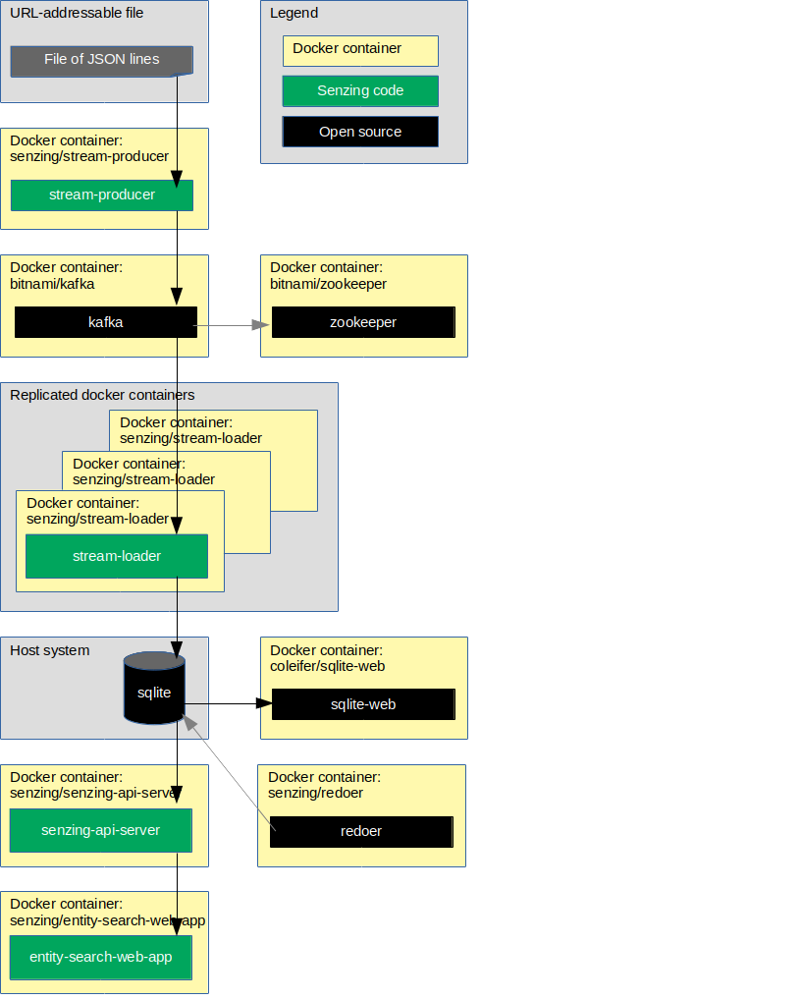

# docker-compose-kafka-sqlite

## Overview

This repository illustrates a reference implementation of Senzing using
Kafka as the queue and
SQLite as the underlying database.

The instructions show how to set up a system that:

1. Reads JSON lines from a file on the internet.
1. Sends each JSON line to a message queue.
    1. In this implementation, the queue is Kafka.
1. Reads messages from the queue and inserts into Senzing.
    1. In this implementation, Senzing keeps its data in a SQLite database.
1. Reads information from Senzing via [Senzing REST API](https://github.com/Senzing/senzing-rest-api) server.
1. Views resolved entities in a web app.

The following diagram shows the relationship of the docker containers in this docker composition.
Arrows represent data flow.



This docker formation brings up the following docker containers:

1. *[bitnami/kafka](https://github.com/bitnami/bitnami-docker-kafka)*
1. *[bitnami/zookeeper](https://github.com/bitnami/bitnami-docker-zookeeper)*
1. *[coleifer/sqlite-web](https://github.com/coleifer/sqlite-web)*
1. *[senzing/entity-web-search-app](https://github.com/Senzing/entity-search-web-app)*
1. *[senzing/mock-data-generator](https://github.com/Senzing/mock-data-generator)*
1. *[senzing/senzing-api-server](https://github.com/Senzing/senzing-api-server)*
1. *[senzing/stream-loader](https://github.com/Senzing/stream-loader)*

### Contents

1. [Expectations](#expectations)
    1. [Space](#space)
    1. [Time](#time)
    1. [Background knowledge](#background-knowledge)
1. [Preparation](#preparation)
    1. [Prerequisite software](#prerequisite-software)
    1. [Clone repository](#clone-repository)
1. [Using docker-compose](#using-docker-compose)
    1. [Configuration](#configuration)
    1. [Volumes](#volumes)
    1. [EULA](#eula)
    1. [Run docker formation](#run-docker-formation)
    1. [View data](#view-data)
    1. [View Senzing API](#view-senzing-api)
1. [Cleanup](#cleanup)

## Expectations

### Space

This repository and demonstration require 7 GB free disk space.

### Time

Budget 2 hours to get the demonstration up-and-running, depending on CPU and network speeds.

### Background knowledge

This repository assumes a working knowledge of:

1. [Docker](https://github.com/Senzing/knowledge-base/blob/master/WHATIS/docker.md)
1. [Docker-compose](https://github.com/Senzing/knowledge-base/blob/master/WHATIS/docker-compose.md)

## Preparation

### Prerequisite software

The following software programs need to be installed:

1. [docker](https://github.com/Senzing/knowledge-base/blob/master/HOWTO/install-docker.md)
1. [docker-compose](https://github.com/Senzing/knowledge-base/blob/master/HOWTO/install-docker-compose.md)

### Clone repository

For more information on environment variables,
see [Environment Variables](https://github.com/Senzing/knowledge-base/blob/master/lists/environment-variables.md).

1. Set these environment variable values:

    ```console
    export GIT_ACCOUNT=senzing
    export GIT_REPOSITORY=docker-compose-demo
    ```

1. Follow steps in [clone-repository](https://github.com/Senzing/knowledge-base/blob/master/HOWTO/clone-repository.md) to install the Git repository.

1. After the repository has been cloned, be sure the following are set:

    ```console
    export GIT_ACCOUNT_DIR=~/${GIT_ACCOUNT}.git
    export GIT_REPOSITORY_DIR="${GIT_ACCOUNT_DIR}/${GIT_REPOSITORY}"
    ```

## Using docker-compose

### Configuration

Configuration values specified by environment variable or command line parameter.

- **[SENZING_ACCEPT_EULA](https://github.com/Senzing/knowledge-base/blob/master/lists/environment-variables.md#senzing_accept_eula)**
- **[SENZING_DATA_VERSION_DIR](https://github.com/Senzing/knowledge-base/blob/master/lists/environment-variables.md#senzing_data_version_dir)**
- **[SENZING_ETC_DIR](https://github.com/Senzing/knowledge-base/blob/master/lists/environment-variables.md#senzing_etc_dir)**
- **[SENZING_G2_DIR](https://github.com/Senzing/knowledge-base/blob/master/lists/environment-variables.md#senzing_g2_dir)**
- **[SENZING_VAR_DIR](https://github.com/Senzing/knowledge-base/blob/master/lists/environment-variables.md#senzing_var_dir)**

### Volumes

The output of `yum install senzingapi` places files in different directories.
Create a folder for each output directory.

1. :pencil2: Option #1.
   To mimic an actual RPM installation,
   identify directories for RPM output in this manner:

    ```console
    export SENZING_DATA_DIR=/opt/senzing/data
    export SENZING_DATA_VERSION_DIR=${SENZING_DATA_DIR}/1.0.0
    export SENZING_ETC_DIR=/etc/opt/senzing
    export SENZING_G2_DIR=/opt/senzing/g2
    export SENZING_VAR_DIR=/var/opt/senzing
    ```

1. :pencil2: Option #2.
   If Senzing directories were put in alternative directories,
   set environment variables to reflect where the directories were placed.
   Example:

    ```console
    export SENZING_VOLUME=/opt/my-senzing

    export SENZING_DATA_DIR=${SENZING_VOLUME}/data
    export SENZING_DATA_VERSION_DIR=${SENZING_DATA_DIR}/1.0.0
    export SENZING_ETC_DIR=${SENZING_VOLUME}/etc
    export SENZING_G2_DIR=${SENZING_VOLUME}/g2
    export SENZING_VAR_DIR=${SENZING_VOLUME}/var
    ```

### EULA

To use the Senzing code, you must agree to the End User License Agreement (EULA).

1. :warning: This step is intentionally tricky and not simply copy/paste.
   This ensures that you make a conscious effort to accept the EULA.
   See
   [SENZING_ACCEPT_EULA](https://github.com/Senzing/knowledge-base/blob/master/lists/environment-variables.md#senzing_accept_eula)
   for the correct value.
   Replace the double-quote character in the example with the correct value.
   The use of the double-quote character is intentional to prevent simple copy/paste.
   Example:

    ```console
    export SENZING_ACCEPT_EULA="
    ```

### Run docker formation

1. If Senzing has not been installed, install Senzing.
   Example:

    ```console
    cd ${GIT_REPOSITORY_DIR}
    sudo \
      SENZING_ACCEPT_EULA=${SENZING_ACCEPT_EULA} \
      SENZING_DATA_DIR=${SENZING_DATA_DIR} \
      SENZING_ETC_DIR=${SENZING_ETC_DIR} \
      SENZING_G2_DIR=${SENZING_G2_DIR} \
      SENZING_VAR_DIR=${SENZING_VAR_DIR} \
      docker-compose --file resources/senzing/docker-compose-senzing-installation.yaml up
    ```

1. Bring down Senzing installer.
   Example:

    ```console
    cd ${GIT_REPOSITORY_DIR}
    sudo docker-compose --file resources/senzing/docker-compose-senzing-installation.yaml down
    ```

1. Initialize database and Senzing.
   Example:

    ```console
    cd ${GIT_REPOSITORY_DIR}
    sudo \
      SENZING_DATA_VERSION_DIR=${SENZING_DATA_VERSION_DIR} \
      SENZING_ETC_DIR=${SENZING_ETC_DIR} \
      SENZING_G2_DIR=${SENZING_G2_DIR} \
      SENZING_VAR_DIR=${SENZING_VAR_DIR} \
      docker-compose --file resources/sqlite/docker-compose-sqlite-initialization.yaml up
    ```

1. Wait until containers have completed their work.
   Look for the following in the docker logs.
   Examples:

   senzing-init-container

    ```console
    yyyy-mm-ss hh:mm:ss,xxx senzing-50070298I Exit {...
    ```

1. Bring down database initialization.
   Example:

    ```console
    cd ${GIT_REPOSITORY_DIR}
    sudo docker-compose --file resources/sqlite/docker-compose-sqlite-initialization.yaml down
    ```

1. Launch docker-compose formation.
   Example:

    ```console
    cd ${GIT_REPOSITORY_DIR}
    sudo \
      SENZING_DATA_VERSION_DIR=${SENZING_DATA_VERSION_DIR} \
      SENZING_ETC_DIR=${SENZING_ETC_DIR} \
      SENZING_G2_DIR=${SENZING_G2_DIR} \
      SENZING_VAR_DIR=${SENZING_VAR_DIR} \
      docker-compose --file resources/sqlite/docker-compose-kafka-sqlite.yaml up
    ```

### View data

1. Username and password for the following sites were either passed in as environment variables
   or are the default values seen in
   [docker-compose-kafka-sqlite.yaml](../../resources/sqlite/docker-compose-kafka-sqlite.yaml).
1. SQLite is viewable at
   [localhost:8080](http://localhost:8080).
    1. The records received from the queue can be viewed in the following Senzing tables:
        1. G2 > DSRC_RECORD
        1. G2 > OBS_ENT
1. Senzing Entity Search WebApp is viewable at
   [localhost:8888](http://localhost:8888).
   The [demonstration](https://github.com/Senzing/knowledge-base/blob/master/demonstrations/docker-compose-web-app.md)
   instructions will give a tour of the Senzing web app.

### View Senzing API

1. View results from Senzing REST API server.
   The server supports the
   [Senzing REST API](https://github.com/Senzing/senzing-rest-api).
   *Note:*  In
   [docker-compose-kafka-sqlite.yaml](../../resources/sqlite/docker-compose-kafka-sqlite.yaml)
   port 8889 on the localhost has been mapped to port 8080 in the docker container.
   Example:

    ```console
    export SENZING_API_SERVICE=http://localhost:8889

    curl -X GET ${SENZING_API_SERVICE}/heartbeat
    curl -X GET ${SENZING_API_SERVICE}/license
    curl -X GET ${SENZING_API_SERVICE}/entities/1
    ```

## Cleanup

In a separate (or reusable) terminal window:

1. Use environment variable describe in "[Clone repository](#clone-repository)" and "[Configuration](#configuration)".
1. Run `docker-compose` command.

    ```console
    cd ${GIT_REPOSITORY_DIR}
    sudo docker-compose --file resources/sqlite/docker-compose-kafka-sqlite.yaml down
    ```

1. Delete git repository.

    ```console
    sudo rm -rf ${GIT_REPOSITORY_DIR}
    ```
