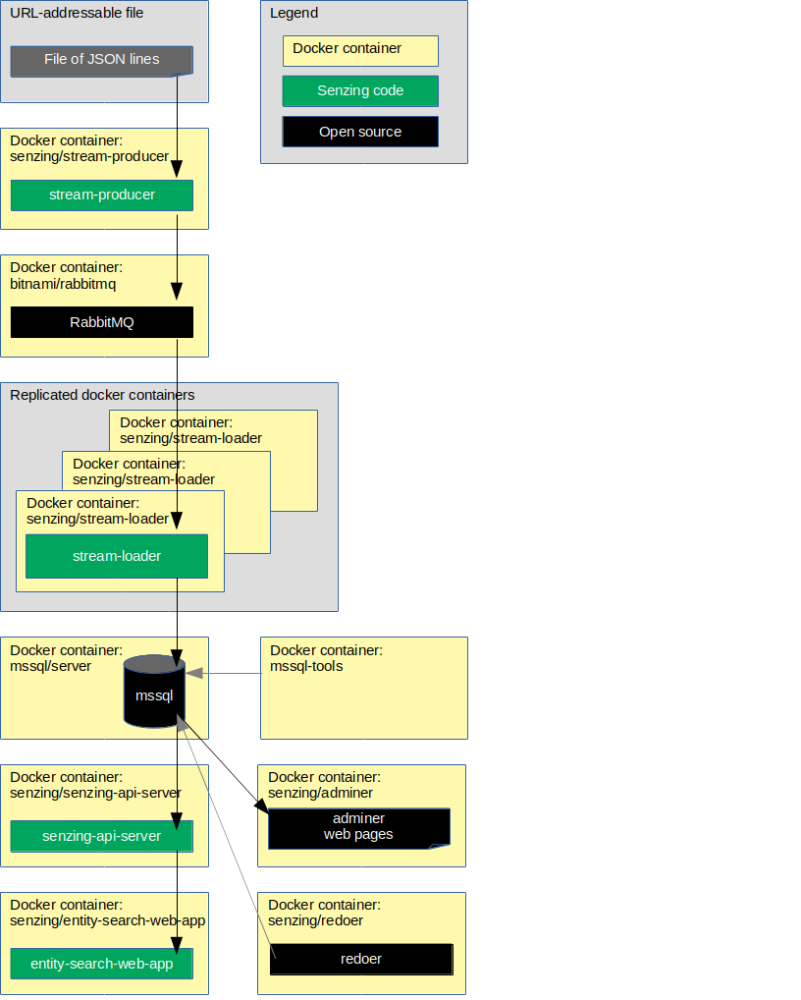

# docker-compose-rabbitmq-mssql

## Overview

This repository illustrates a reference implementation of Senzing using
RabbitMQ as the queue and
MSSQL as the underlying database.

The instructions show how to set up a system that:

1. Reads JSON lines from a file on the internet.
1. Sends each JSON line to a message queue.
    1. In this implementation, the queue is RabbitMQ.
1. Reads messages from the queue and inserts into Senzing.
    1. In this implementation, Senzing keeps its data in a MSSQL database.
1. Reads information from Senzing via [Senzing REST API](https://github.com/Senzing/senzing-rest-api-specification) server.
1. Views resolved entities in a [web app](https://github.com/Senzing/entity-search-web-app).

The following diagram shows the relationship of the docker containers in this docker composition.
Arrows represent data flow.



This docker formation brings up the following docker containers:

1. *[bitnami/rabbitmq](https://github.com/bitnami/bitnami-docker-rabbitmq)*
1. *[mcr.microsoft.com/mssql/server:2019-GA-ubuntu-16.04](https://github.com/Microsoft/mssql-docker)*
1. *[mcr.microsoft.com/mssql-tools](https://github.com/Microsoft/mssql-docker)*
1. *[senzing/adminer](https://github.com/Senzing/docker-adminer)*
1. *[senzing/console](https://github.com/Senzing/docker-senzing-console)*
1. *[senzing/entity-web-search-app](https://github.com/Senzing/entity-search-web-app)*
1. *[senzing/init-container](https://github.com/Senzing/docker-init-container)*
1. *[senzing/jupyter](https://github.com/Senzing/docker-jupyter)*
1. *[senzing/redoer](https://github.com/Senzing/redoer)*
1. *[senzing/stream-producer](https://github.com/Senzing/stream-producer)*
1. *[senzing/senzing-api-server](https://github.com/Senzing/senzing-api-server)*
1. *[senzing/stream-loader](https://github.com/Senzing/stream-loader)*

### Contents

1. [Expectations](#expectations)
    1. [Space](#space)
    1. [Time](#time)
    1. [Background knowledge](#background-knowledge)
1. [Preparation](#preparation)
    1. [Prerequisite software](#prerequisite-software)
    1. [Clone repository](#clone-repository)
1. [Using docker-compose](#using-docker-compose)
    1. [Volumes](#volumes)
    2. [SSH port](#ssh-port)
    3. [Set sshd password](#set-sshd-password)
    3. [EULA](#eula)
    4. [Install Senzing](#install-senzing)
    5. [Install Senzing license](#install-senzing-license)
    6. [Install MS SQL driver](#install-ms-sql-driver)
    7. [Run docker formation](#run-docker-formation)
1. [View data](#view-data)
    1. [View docker containers](#view-docker-containers)
    2. [Use SSH](#use-ssh)
    3. [View RabbitMQ](#view-rabbitmq)
    4. [View MSSQL](#view-mssql)
    5. [View Senzing API](#view-senzing-api)
    6. [View Senzing Entity Search WebApp](#view-senzing-entity-search-webapp)
    7. [View X-Term](#view-x-term)
1. [Cleanup](#cleanup)
1. [Advanced](#advanced)
    1. [Re-run docker formation](#re-run-docker-formation)
    1. [Configuration](#configuration)
1. [Notes](#notes)
    1. [Running non-root](#running-non-root)

### Legend

1. :thinking: - A "thinker" icon means that a little extra thinking may be required.
   Perhaps you'll need to make some choices.
   Perhaps it's an optional step.
1. :pencil2: - A "pencil" icon means that the instructions may need modification before performing.
1. :warning: - A "warning" icon means that something tricky is happening, so pay attention.

## Expectations

### Space

This repository and demonstration require 7 GB free disk space.

### Time

Budget 2 hours to get the demonstration up-and-running, depending on CPU and network speeds.

### Background knowledge

This repository assumes a working knowledge of:

1. [Docker](https://github.com/Senzing/knowledge-base/blob/master/WHATIS/docker.md)
1. [Docker-compose](https://github.com/Senzing/knowledge-base/blob/master/WHATIS/docker-compose.md)

## Preparation

### Prerequisite software

The following software programs need to be installed:

1. [docker](https://github.com/Senzing/knowledge-base/blob/master/HOWTO/install-docker.md)
1. [docker-compose](https://github.com/Senzing/knowledge-base/blob/master/HOWTO/install-docker-compose.md)
1. [git](https://github.com/Senzing/knowledge-base/blob/master/HOWTO/install-git.md)

### Clone repository

For more information on environment variables,
see [Environment Variables](https://github.com/Senzing/knowledge-base/blob/master/lists/environment-variables.md).

1. Set these environment variable values:

    ```console
    export GIT_ACCOUNT=senzing
    export GIT_REPOSITORY=docker-compose-demo
    export GIT_ACCOUNT_DIR=~/${GIT_ACCOUNT}.git
    export GIT_REPOSITORY_DIR="${GIT_ACCOUNT_DIR}/${GIT_REPOSITORY}"
    ```

1. Follow steps in [clone-repository](https://github.com/Senzing/knowledge-base/blob/master/HOWTO/clone-repository.md) to install the Git repository.

## Using docker-compose

### Volumes

1. :pencil2: Specify the directory where Senzing should be installed on the local host.
   Example:

    ```console
    export SENZING_VOLUME=/opt/my-senzing
    ```

    1. :warning:
       **macOS** - [File sharing](https://github.com/Senzing/knowledge-base/blob/master/HOWTO/share-directories-with-docker.md#macos)
       must be enabled for `SENZING_VOLUME`.
    1. :warning:
       **Windows** - [File sharing](https://github.com/Senzing/knowledge-base/blob/master/HOWTO/share-directories-with-docker.md#windows)
       must be enabled for `SENZING_VOLUME`.

1. Identify directories on the local host.
   Example:

    ```console
    export SENZING_DATA_DIR=${SENZING_VOLUME}/data
    export SENZING_DATA_VERSION_DIR=${SENZING_DATA_DIR}/2.0.0
    export SENZING_ETC_DIR=${SENZING_VOLUME}/etc
    export SENZING_G2_DIR=${SENZING_VOLUME}/g2
    export SENZING_OPT_MICROSOFT_DIR=${SENZING_VOLUME}/opt-microsoft
    export SENZING_VAR_DIR=${SENZING_VOLUME}/var

    export MSSQL_DIR=${SENZING_VAR_DIR}/mssql
    export RABBITMQ_DIR=${SENZING_VAR_DIR}/rabbitmq
    ```

1. Create directory for RabbitMQ persistence.
   **Note:** Although the `RABBITMQ_DIR` directory will have open permissions,
   the directories created within `RABBITMQ_DIR` will be restricted.
   Example:

    ```console
    sudo mkdir -p ${RABBITMQ_DIR}
    sudo chmod 770 ${RABBITMQ_DIR}
    ```

### SSH port
:thinking: **Optional** If you do not plan on using the senzing/sshd container then these ssh sections can be ignored

:thinking: Normally port 22 is already in use for `ssh`.
So a different port may be needed by the running docker container.

1. :thinking: **Optional:** See if port 22 is already in use.
   Example:

    ```console
    sudo lsof -i -P -n | grep LISTEN | grep :22
    ````

1. :pencil2: Choose port for docker container.
   Example:

    ```console
    export SENZING_SSHD_PORT=9181
    ```

1. Construct parameter for `docker run`.
   Example:

    ```console
    export SENZING_SSHD_PORT_PARAMETER="--publish ${SENZING_SSHD_PORT:-9181}:22"
    ```

### Set sshd password

:thinking: **Optional** The default password set for the sshd containers is `senzingsshdpassword`. However, this can be set by setting the following variable

:pencil2: Set the `SENZING_SSHD_PASSWORD` variable to change the password to access the sshd container
```console
export SENZING_SSHD_PASSWORD=<Pass_You_Want>
```

### EULA

To use the Senzing code, you must agree to the End User License Agreement (EULA).

1. :warning: This step is intentionally tricky and not simply copy/paste.
   This ensures that you make a conscious effort to accept the EULA.
   Example:

    <pre>export SENZING_ACCEPT_EULA="&lt;the value from <a href="https://github.com/Senzing/knowledge-base/blob/master/lists/environment-variables.md#senzing_accept_eula">this link</a>&gt;"</pre>

### Install Senzing

1. If Senzing has not been installed, install Senzing.
   Example:

    ```console
    cd ${GIT_REPOSITORY_DIR}
    sudo \
      --preserve-env \
      docker-compose --file resources/senzing/docker-compose-senzing-installation.yaml up
    ```

    1. This will download and extract a 3GB file. It may take 5-15 minutes, depending on network speeds.

### Install Senzing license

Senzing comes with a trial license that supports 10,000 records.

1. :thinking: **Optional:**
   If more than 10,000 records are desired, see
   [Senzing license](https://github.com/Senzing/knowledge-base/blob/master/lists/docker-compose-demo-tips.md#senzing-license).

### Install MS SQL driver

1. Install MS SQL driver and initialize files.
   Example:

    ```console
    cd ${GIT_REPOSITORY_DIR}
    sudo \
      --preserve-env \
      docker-compose --file resources/mssql/docker-compose-mssql-driver.yaml up
    ```

1. Wait until completion.

1. Change directory permissions.
   **Note:** Although the `MSSQL_DIR` directory will have open permissions,
   the directories created within `MSSQL_DIR` will be restricted.
   Example:

    ```console
    sudo chmod 777 ${MSSQL_DIR}
    ```

### Run docker formation

1. Launch docker-compose formation.
   Example:

    ```console
    cd ${GIT_REPOSITORY_DIR}
    sudo \
      --preserve-env \
      docker-compose --file resources/mssql/docker-compose-rabbitmq-mssql.yaml up
    ```

1. Allow time for the components to come up and initialize.
    1. There will be errors in some docker logs as they wait for dependent services to become available.
       `docker-compose` isn't the best at orchestrating docker container dependencies.

## View data

Once the docker-compose formation is running,
different aspects of the formation can be viewed.

Username and password for the following sites were either passed in as environment variables
or are the default values seen in
[docker-compose-rabbitmq-mssql.yaml](../../resources/mssql/docker-compose-rabbitmq-mssql.yaml).

### View docker containers

1. A good tool to monitor individual docker logs is
   [Portainer](https://github.com/Senzing/knowledge-base/blob/master/WHATIS/portainer.md).
   When running, Portainer is viewable at
   [localhost:9170](http://localhost:9170).

### Use SSH

Instructions to use the senzing/sshd container are viewable in the [senzing/docker-sshd](https://github.com/Senzing/docker-sshd/blob/master/README.md#ssh-into-container) repository

### View RabbitMQ

1. RabbitMQ is viewable at
   [localhost:15672](http://localhost:15672).
    1. **Defaults:** username: `user` password: `bitnami`
1. See
   [additional tips](https://github.com/Senzing/knowledge-base/blob/master/lists/docker-compose-demo-tips.md#rabbitmq)
   for working with RabbitMQ.

### View MSSQL

1. MSSQL is viewable at
   [localhost:9177](http://localhost:9177).
    1. **System:** MS SQL (beta)
    1. **Server:** senzing-mysql
    1. **Username:** sa
    1. **Password:** Passw0rd
    1. **Database:** G2
1. See
   [additional tips](https://github.com/Senzing/knowledge-base/blob/master/lists/docker-compose-demo-tips.md#ms-sql)
   for working with MSSQL.

### View Senzing API

View results from Senzing REST API server.
The server supports the
[Senzing REST API](https://github.com/Senzing/senzing-rest-api-specification).

1. OpenApi Editor is viewable at
   [localhost:9180](http://localhost:9180).
1. Example Senzing REST API request:
   [localhost:8250/heartbeat](http://localhost:8250/heartbeat)
1. See
   [additional tips](https://github.com/Senzing/knowledge-base/blob/master/lists/docker-compose-demo-tips.md#senzing-api-server)
   for working with Senzing API server.

### View Senzing Entity Search WebApp

1. Senzing Entity Search WebApp is viewable at
   [localhost:8251](http://localhost:8251).
1. See
   [additional tips](https://github.com/Senzing/knowledge-base/blob/master/lists/docker-compose-demo-tips.md#senzing-entity-search-webapp)
   for working with Senzing Entity Search WebApp.

### View X-Term

The web-based Senzing X-term can be used to run Senzing command-line programs.

1. Senzing X-term is viewable at
   [localhost:8254](http://localhost:8254).
1. See
   [additional tips](https://github.com/Senzing/knowledge-base/blob/master/lists/docker-compose-demo-tips.md#senzing-x-term)
   for working with Senzing X-Term.

## Cleanup

When the docker-compose formation is no longer needed,
it can be brought down and directories can be deleted.

1. Bring down docker formation.
   Example:

    ```console
    cd ${GIT_REPOSITORY_DIR}
    sudo docker-compose --file resources/senzing/docker-compose-senzing-installation.yaml down
    sudo docker-compose --file resources/mssql/docker-compose-mssql-driver.yaml down
    sudo docker-compose --file resources/mssql/docker-compose-rabbitmq-mssql.yaml down
    sudo docker-compose --file resources/mssql/docker-compose-rabbitmq-mssql-again.yaml down
    ```

1. Remove directories from host system.
   The following directories were created during the demonstration:
    1. `${SENZING_VOLUME}`
    1. `${GIT_REPOSITORY_DIR}`

   They may be safely deleted.

## Advanced

The following topics discuss variations to the basic docker-compose demonstration.

### Re-run docker formation

:thinking: **Optional:** After the launch and shutdown of the original docker formation,
the docker formation can be brought up again without requiring initialization steps.
The following shows how to bring up the prior docker formation again without initialization.

1. Launch docker-compose formation.
   Example:

    ```console
    cd ${GIT_REPOSITORY_DIR}
    sudo \
      --preserve-env \
      docker-compose --file resources/mssql/docker-compose-rabbitmq-mssql-again.yaml up
    ```

### Configuration

Configuration values specified by environment variable or command line parameter.

- **[MSSQL_DATABASE](https://github.com/Senzing/knowledge-base/blob/master/lists/environment-variables.md#mssql_database)**
- **[MSSQL_DIR](https://github.com/Senzing/knowledge-base/blob/master/lists/environment-variables.md#mssql_dir)**
- **[MSSQL_PASSWORD](https://github.com/Senzing/knowledge-base/blob/master/lists/environment-variables.md#mssql_passwrod)**
- **[MSSQL_ROOT_PASSWORD](https://github.com/Senzing/knowledge-base/blob/master/lists/environment-variables.md#mssql_root-password)**
- **[MSSQL_USERNAME](https://github.com/Senzing/knowledge-base/blob/master/lists/environment-variables.md#mssql_username)**
- **[RABBITMQ_DIR](https://github.com/Senzing/knowledge-base/blob/master/lists/environment-variables.md#rabbitmq_dir)**
- **[RABBITMQ_PASSWORD](https://github.com/Senzing/knowledge-base/blob/master/lists/environment-variables.md#rabbitmq_password)**
- **[RABBITMQ_USERNAME](https://github.com/Senzing/knowledge-base/blob/master/lists/environment-variables.md#rabbitmq_username)**
- **[SENZING_ACCEPT_EULA](https://github.com/Senzing/knowledge-base/blob/master/lists/environment-variables.md#senzing_accept_eula)**
- **[SENZING_DATA_DIR](https://github.com/Senzing/knowledge-base/blob/master/lists/environment-variables.md#senzing_data_dir)**
- **[SENZING_DATA_SOURCE](https://github.com/Senzing/knowledge-base/blob/master/lists/environment-variables.md#senzing_data_source)**
- **[SENZING_DATA_VERSION_DIR](https://github.com/Senzing/knowledge-base/blob/master/lists/environment-variables.md#senzing_data_version_dir)**
- **[SENZING_ENTITY_TYPE](https://github.com/Senzing/knowledge-base/blob/master/lists/environment-variables.md#senzing_entity_type)**
- **[SENZING_ETC_DIR](https://github.com/Senzing/knowledge-base/blob/master/lists/environment-variables.md#senzing_etc_dir)**
- **[SENZING_G2_DIR](https://github.com/Senzing/knowledge-base/blob/master/lists/environment-variables.md#senzing_g2_dir)**
- **[SENZING_OPT_MICROSOFT_DIR](https://github.com/Senzing/knowledge-base/blob/master/lists/environment-variables.md#senzing_opt_microsoft_dir)**
- **[SENZING_VAR_DIR](https://github.com/Senzing/knowledge-base/blob/master/lists/environment-variables.md#senzing_var_dir)**

## Notes

### Running non-root

1. The `senzing/stream-loader` and `senzing/senzing-api-server` containers are run under user `nobody` (65534).
   The reason for this is that a UID need to be selected that has a "home" directory when using ODBC.
   Rather than "hard-coding" docker images with a specific userid, an existing non-root userid is used.
   This is a known issue:
    1. [github.com/microsoft/mssql-docker/issues/431](https://github.com/microsoft/mssql-docker/issues/431).
1. The practice of "hard-coding" docker images with a specific userid, specifically the use of `useradd`,
   are problematic with system like OpenShift which determine the UID of a docker container based on the project.
   See [OpenShift: Why do my applications run as a random user ID?](https://cookbook.openshift.org/users-and-role-based-access-control/why-do-my-applications-run-as-a-random-user-id.html)
