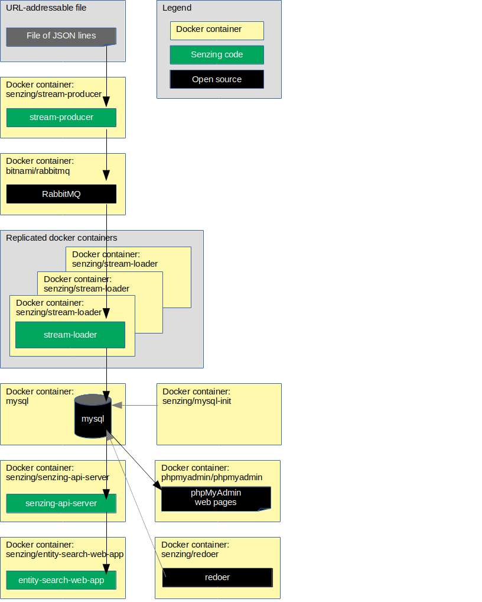

# docker-compose-rabbitmq-mysql

## Overview

This repository illustrates a reference implementation of Senzing using
RabbitMQ as the queue and
MySQL as the underlying database.

The instructions show how to set up a system that:

1. Reads JSON lines from a file on the internet.
1. Sends each JSON line to a message queue.
    1. In this implementation, the queue is RabbitMQ.
1. Reads messages from the queue and inserts into Senzing.
    1. In this implementation, Senzing keeps its data in a MySQL database.
1. Reads information from Senzing via [Senzing REST API](https://github.com/Senzing/senzing-rest-api) server.
1. Views resolved entities in a [web app](https://github.com/Senzing/entity-search-web-app).

The following diagram shows the relationship of the docker containers in this docker composition.
Arrows represent data flow.



This docker formation brings up the following docker containers:

1. *[bitnami/rabbitmq](https://github.com/bitnami/bitnami-docker-rabbitmq)*
1. *[mysql](https://github.com/docker-library/mysql)*
1. *[phpmyadmin/phpmyadmin](https://github.com/phpmyadmin/docker)*
1. *[senzing/entity-web-search-app](https://github.com/Senzing/entity-search-web-app)*
1. *[senzing/mock-data-generator](https://github.com/Senzing/mock-data-generator)*
1. *[senzing/mysql-init](https://github.com/Senzing/docker-mysql-init)*
1. *[senzing/senzing-api-server](https://github.com/Senzing/senzing-api-server)*
1. *[senzing/stream-loader](https://github.com/Senzing/stream-loader)*

### Contents

1. [Expectations](#expectations)
    1. [Space](#space)
    1. [Time](#time)
    1. [Background knowledge](#background-knowledge)
1. [Preparation](#preparation)
    1. [Prerequisite software](#prerequisite-software)
    1. [Clone repository](#clone-repository)
    1. [Pull docker images](#pull-docker-images)
    1. [Build docker images](#build-docker-images)
1. [Using docker-compose](#using-docker-compose)
    1. [Configuration](#configuration)
    1. [Volumes](#volumes)
    1. [EULA](#eula)
    1. [Install Senzing](#install-senzing)
    1. [Run docker formation](#run-docker-formation)
1. [View data](#view-data)
    1. [View RabbitMQ](#view-rabbitmq)
    1. [View MySQL](#view-mysql)
    1. [View Senzing API](#view-senzing-api)
    1. [View Senzing Entity Search WebApp](#view-senzing-entity-search-webapp)
1. [Cleanup](#cleanup)
1. [Re-run docker formation](#re-run-docker-formation)

## Expectations

### Space

This repository and demonstration require 7 GB free disk space.

### Time

Budget 2 hours to get the demonstration up-and-running, depending on CPU and network speeds.

### Background knowledge

This repository assumes a working knowledge of:

1. [Docker](https://github.com/Senzing/knowledge-base/blob/master/WHATIS/docker.md)
1. [Docker-compose](https://github.com/Senzing/knowledge-base/blob/master/WHATIS/docker-compose.md)

## Preparation

### Prerequisite software

The following software programs need to be installed:

1. [docker](https://github.com/Senzing/knowledge-base/blob/master/HOWTO/install-docker.md)
1. [docker-compose](https://github.com/Senzing/knowledge-base/blob/master/HOWTO/install-docker-compose.md)

### Clone repository

For more information on environment variables,
see [Environment Variables](https://github.com/Senzing/knowledge-base/blob/master/lists/environment-variables.md).

1. Set these environment variable values:

    ```console
    export GIT_ACCOUNT=senzing
    export GIT_REPOSITORY=docker-compose-demo
    export GIT_ACCOUNT_DIR=~/${GIT_ACCOUNT}.git
    export GIT_REPOSITORY_DIR="${GIT_ACCOUNT_DIR}/${GIT_REPOSITORY}"
    ```

1. Follow steps in [clone-repository](https://github.com/Senzing/knowledge-base/blob/master/HOWTO/clone-repository.md) to install the Git repository.

### Pull docker images

1. :thinking: **Optional:** To speed up following steps, docker images may be pulled in advance.
   Example:

    ```console
    sudo docker pull bitnami/rabbitmq:3.7.16
    sudo docker pull mysql:5.7
    sudo docker pull phpmyadmin/phpmyadmin:4.9
    sudo docker pull senzing/entity-search-web-app:1.0.2
    sudo docker pull senzing/init-container:1.3.0
    sudo docker pull senzing/mock-data-generator:1.1.0
    sudo docker pull senzing/senzing-api-server:1.7.2
    sudo docker pull senzing/stream-loader:1.2.0
    sudo docker pull senzing/yum:1.1.0
    ```

### Build docker images

1. Build docker images.

    ```console
    sudo docker build \
      --tag senzing/mysql-init \
      https://github.com/senzing/docker-mysql-init.git
    ```

## Using docker-compose

### Configuration

Configuration values specified by environment variable or command line parameter.

- **[MYSQL_DATABASE](https://github.com/Senzing/knowledge-base/blob/master/lists/environment-variables.md#mysql_database)**
- **[MYSQL_PASSWORD](https://github.com/Senzing/knowledge-base/blob/master/lists/environment-variables.md#mysql_passwrod)**
- **[MYSQL_ROOT_PASSWORD](https://github.com/Senzing/knowledge-base/blob/master/lists/environment-variables.md#mysql_root-password)**
- **[MYSQL_STORAGE](https://github.com/Senzing/knowledge-base/blob/master/lists/environment-variables.md#mysql_storage)**
- **[MYSQL_USERNAME](https://github.com/Senzing/knowledge-base/blob/master/lists/environment-variables.md#mysql_username)**
- **[RABBITMQ_PASSWORD](https://github.com/Senzing/knowledge-base/blob/master/lists/environment-variables.md#rabbitmq_password)**
- **[RABBITMQ_STORAGE](https://github.com/Senzing/knowledge-base/blob/master/lists/environment-variables.md#rabbitmq_storage)**
- **[RABBITMQ_USERNAME](https://github.com/Senzing/knowledge-base/blob/master/lists/environment-variables.md#rabbitmq_username)**
- **[SENZING_ACCEPT_EULA](https://github.com/Senzing/knowledge-base/blob/master/lists/environment-variables.md#senzing_accept_eula)**
- **[SENZING_DATA_DIR](https://github.com/Senzing/knowledge-base/blob/master/lists/environment-variables.md#senzing_data_dir)**
- **[SENZING_DATA_SOURCE](https://github.com/Senzing/knowledge-base/blob/master/lists/environment-variables.md#senzing_data_source)**
- **[SENZING_DATA_VERSION_DIR](https://github.com/Senzing/knowledge-base/blob/master/lists/environment-variables.md#senzing_data_version_dir)**
- **[SENZING_ENTITY_TYPE](https://github.com/Senzing/knowledge-base/blob/master/lists/environment-variables.md#senzing_entity_type)**
- **[SENZING_ETC_DIR](https://github.com/Senzing/knowledge-base/blob/master/lists/environment-variables.md#senzing_etc_dir)**
- **[SENZING_G2_DIR](https://github.com/Senzing/knowledge-base/blob/master/lists/environment-variables.md#senzing_g2_dir)**

### Volumes

:thinking: The output of `yum install senzingapi` places files in different directories.
Identify a folder for each output directory.

1. :pencil2: **Example #1:**
   To mimic an actual RPM installation,
   identify directories for RPM output in this manner:

    ```console
    export SENZING_DATA_DIR=/opt/senzing/data
    export SENZING_DATA_VERSION_DIR=${SENZING_DATA_DIR}/1.0.0
    export SENZING_ETC_DIR=/etc/opt/senzing
    export SENZING_G2_DIR=/opt/senzing/g2
    ```

1. :pencil2: **Example #2:**
   Senzing directories can be put in alternative directories.
   Example:

    ```console
    export SENZING_VOLUME=/opt/my-senzing

    export SENZING_DATA_DIR=${SENZING_VOLUME}/data
    export SENZING_DATA_VERSION_DIR=${SENZING_DATA_DIR}/1.0.0
    export SENZING_ETC_DIR=${SENZING_VOLUME}/etc
    export SENZING_G2_DIR=${SENZING_VOLUME}/g2
    ```

### EULA

To use the Senzing code, you must agree to the End User License Agreement (EULA).

1. :warning: This step is intentionally tricky and not simply copy/paste.
   This ensures that you make a conscious effort to accept the EULA.
   See
   [SENZING_ACCEPT_EULA](https://github.com/Senzing/knowledge-base/blob/master/lists/environment-variables.md#senzing_accept_eula)
   for the correct value.
   Replace the double-quote character in the example with the correct value.
   The use of the double-quote character is intentional to prevent simple copy/paste.
   Example:

    ```console
    export SENZING_ACCEPT_EULA="
    ```

### Install Senzing

1. If Senzing has not been installed, install Senzing.
   Example:

    ```console
    cd ${GIT_REPOSITORY_DIR}
    sudo \
      SENZING_ACCEPT_EULA=${SENZING_ACCEPT_EULA} \
      SENZING_DATA_DIR=${SENZING_DATA_DIR} \
      SENZING_ETC_DIR=${SENZING_ETC_DIR} \
      SENZING_G2_DIR=${SENZING_G2_DIR} \
      docker-compose --file resources/senzing/docker-compose-senzing-installation.yaml up
    ```

### Run docker formation

1. :pencil2: Set environment variables.
   Example:

    ```console
    export MYSQL_DATABASE=G2
    export MYSQL_ROOT_PASSWORD=root
    export MYSQL_STORAGE=/storage/docker/senzing/docker-compose-rabbitmq-mysql/mysql
    export RABBITMQ_STORAGE=/storage/docker/senzing/docker-compose-rabbitmq-mysql/rabbitmq
    ```

1. Create directories.
   Example:

    ```console
    sudo mkdir -p ${RABBITMQ_STORAGE}
    sudo chmod 777 ${RABBITMQ_STORAGE}
    ```

1. Launch docker-compose formation.
   Example:

    ```console
    cd ${GIT_REPOSITORY_DIR}
    sudo \
      MYSQL_DATABASE=${MYSQL_DATABASE} \
      MYSQL_ROOT_PASSWORD=${MYSQL_ROOT_PASSWORD} \
      MYSQL_STORAGE=${MYSQL_STORAGE} \
      RABBITMQ_STORAGE=${RABBITMQ_STORAGE} \
      SENZING_DATA_VERSION_DIR=${SENZING_DATA_VERSION_DIR} \
      SENZING_ETC_DIR=${SENZING_ETC_DIR} \
      SENZING_G2_DIR=${SENZING_G2_DIR} \
      docker-compose --file resources/mysql/docker-compose-rabbitmq-mysql.yaml up
    ```

## View data

1. Username and password for the following sites were either passed in as environment variables
   or are the default values seen in
   [docker-compose-rabbitmq-mysql.yaml](../../resources/mysql/docker-compose-rabbitmq-mysql.yaml).

### View RabbitMQ

1. RabbitMQ is viewable at
   [localhost:15672](http://localhost:15672).
    1. **Defaults:** username: `user` password: `bitnami`

### View MySQL

1. MySQL is viewable at
   [localhost:8080](http://localhost:8080).
    1. **Defaults:** username: `g2` password: `g2`
1. On left-hand navigation, select "G2" database to explore.
1. The records received from the queue can be viewed in the following Senzing tables:
    1. G2 > DSRC_RECORD
    1. G2 > OBS_ENT

### View Senzing API

1. View results from Senzing REST API server.
   The server supports the
   [Senzing REST API](https://github.com/Senzing/senzing-rest-api).
   *Note:*  In
   [docker-compose-rabbitmq-mysql.yaml](../../resources/mysql/docker-compose-rabbitmq-mysql.yaml)
   port 8889 on the localhost has been mapped to port 8080 in the docker container.

   1. From a web browser.
      Examples:
      1. [localhost:8889/heartbeat](http://localhost:8889/heartbeat)
      1. [localhost:8889/license](http://localhost:8889/license)
      1. [localhost:8889/entities/1](http://localhost:8889/entities/1)
   1. From `curl`.
      Examples:

        ```console
        export SENZING_API_SERVICE=http://localhost:8889

        curl -X GET ${SENZING_API_SERVICE}/heartbeat
        curl -X GET ${SENZING_API_SERVICE}/license
        curl -X GET ${SENZING_API_SERVICE}/entities/1
        ```

### View Senzing Entity Search WebApp

1. Senzing Entity Search WebApp is viewable at
   [localhost:8888](http://localhost:8888).
   The [demonstration](https://github.com/Senzing/knowledge-base/blob/master/demonstrations/docker-compose-web-app.md)
   instructions will give a tour of the Senzing web app.

## Cleanup

In a separate (or reusable) terminal window:

1. Use environment variable describe in "[Clone repository](#clone-repository)" and "[Configuration](#configuration)".
1. Run `docker-compose` command.

    ```console
    cd ${GIT_REPOSITORY_DIR}
    sudo docker-compose --file resources/senzing/docker-compose-senzing-installation.yaml down
    sudo docker-compose --file resources/mysql/docker-compose-rabbitmq-mysql.yaml down
    sudo docker-compose --file resources/mysql/docker-compose-rabbitmq-mysql-again.yaml down
    ```

1. Delete storage.

    ```console
    sudo rm -rf ${MYSQL_STORAGE}
    sudo rm -rf ${RABBITMQ_STORAGE}
    ```

1. Delete git repository.

    ```console
    sudo rm -rf ${GIT_REPOSITORY_DIR}
    ```

## Re-run docker formation

:thinking: **Optional:** After the launch and shutdown of the original docker formation,
the docker formation can be brought up again without requiring initialization steps.
The following shows how to bring up the prior docker formation again without initialization.

1. Launch docker-compose formation.
   Example:

    ```console
    cd ${GIT_REPOSITORY_DIR}
    sudo \
      MYSQL_DATABASE=${MYSQL_DATABASE} \
      MYSQL_ROOT_PASSWORD=${MYSQL_ROOT_PASSWORD} \
      MYSQL_STORAGE=${MYSQL_STORAGE} \
      RABBITMQ_STORAGE=${RABBITMQ_STORAGE} \
      SENZING_DATA_VERSION_DIR=${SENZING_DATA_VERSION_DIR} \
      SENZING_ETC_DIR=${SENZING_ETC_DIR} \
      SENZING_G2_DIR=${SENZING_G2_DIR} \
      docker-compose --file resources/mysql/docker-compose-rabbitmq-mysql-again.yaml up
    ```
