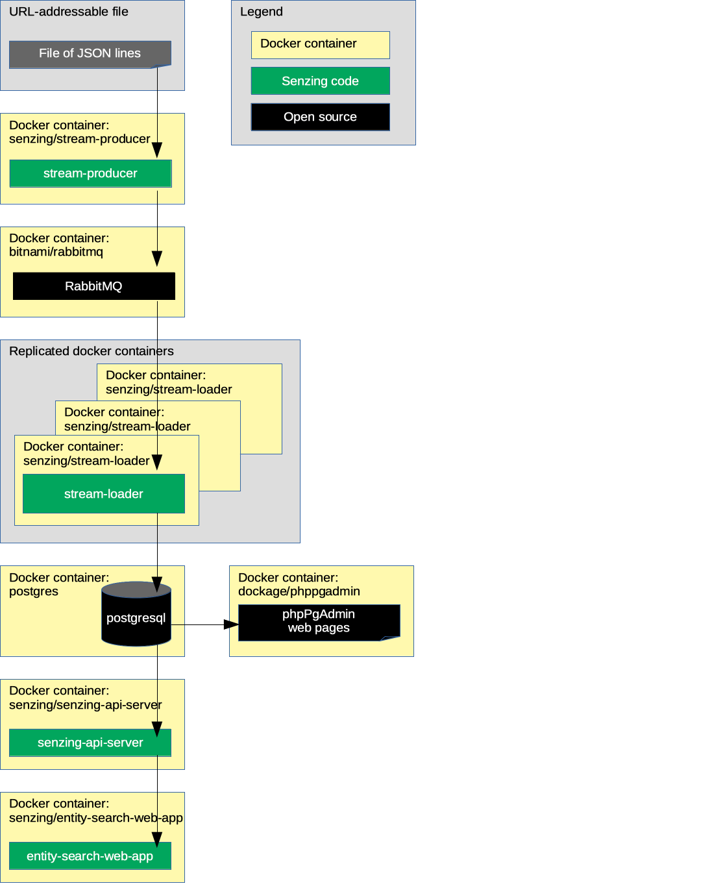

# docker-compose-rabbitmq-postgresql-advanced

## Synopsis

Using `docker-compose`, bring up a Senzing stack
using RabbitMQ and a PostgreSQL database.

These instructions support multiple docker-compose.yaml files.

## Overview

This repository illustrates a reference implementation of Senzing using
RabbitMQ as the queue and
PostgreSQL as the underlying database.

The instructions show how to set up a system that:

1. Reads JSON lines from a file on the internet and sends each JSON line to a message queue via the Senzing
   [stream-producer](https://github.com/Senzing/stream-producer).
    1. In this implementation, the queue is RabbitMQ.
1. Reads messages from the queue and inserts into Senzing via the Senzing
   [stream-loader](https://github.com/Senzing/stream-loader).
    1. In this implementation, Senzing keeps its data in a PostgreSQL database.
1. Reads information from Senzing via [Senzing API Server](https://github.com/Senzing/senzing-api-server) server.
1. Views resolved entities in a [web app](https://github.com/Senzing/entity-search-web-app).

The following diagram shows the relationship of the docker containers in this docker composition.
Arrows represent data flow.



### Contents

1. [Preamble](#preamble)
1. [Related artifacts](#related-artifacts)
1. [Expectations](#expectations)
1. [Prerequisites](#prerequisites)
    1. [Prerequisite software](#prerequisite-software)
    1. [Clone repository](#clone-repository)
1. [Demonstrate](#demonstrate)
    1. [Volumes](#volumes)
    1. [SSH port](#ssh-port)
    1. [Set sshd password](#set-sshd-password)
    1. [EULA](#eula)
    1. [Choose docker formation](#choose-docker-formation)
        1. [Standard formation](#standard-formation)
        1. [Withinfo formation](#withinfo-formation)
        1. [Redoer formation](#redoer-formation)
        1. [Redoer queuing formation](#redoer-queuing-formation)
        1. [Withinfo and Redoer formation](#withinfo-and-redoer-formation)
        1. [Withinfo and Redoer queuing formation](#withinfo-and-redoer-queuing-formation)
    1. [Pull docker images](#pull-docker-images)
    1. [Install Senzing](#install-senzing)
    1. [Install Senzing license](#install-senzing-license)
    1. [Run docker formation](#run-docker-formation)
    1. [View data](#view-data)
        1. [View docker containers](#view-docker-containers)
        1. [Use SSH](#use-ssh)
        1. [View RabbitMQ](#view-rabbitmq)
        1. [View PostgreSQL](#view-postgresql)
        1. [View Senzing API Server](#view-senzing-api-server)
        1. [View Senzing Entity Search WebApp](#view-senzing-entity-search-webapp)
        1. [View Jupyter notebooks](#view-jupyter-notebooks)
        1. [View X-Term](#view-x-term)
1. [Cleanup](#cleanup)
1. [Advanced](#advanced)
    1. [Docker images](#docker-images)
    1. [Configuration](#configuration)
    1. [Program parameter matrix](#program-parameter-matrix)
1. [Errors](#errors)
1. [References](#references)

## Preamble

At [Senzing](http://senzing.com),
we strive to create GitHub documentation in a
"[don't make me think](https://github.com/Senzing/knowledge-base/blob/master/WHATIS/dont-make-me-think.md)" style.
For the most part, instructions are copy and paste.
Whenever thinking is needed, it's marked with a "thinking" icon :thinking:.
Whenever customization is needed, it's marked with a "pencil" icon :pencil2:.
If the instructions are not clear, please let us know by opening a new
[Documentation issue](https://github.com/Senzing/docker-compose-demo/issues/new?assignees=&labels=&template=documentation_request.md)
describing where we can improve.   Now on with the show...

### Legend

1. :thinking: - A "thinker" icon means that a little extra thinking may be required.
   Perhaps you'll need to make some choices.
   Perhaps it's an optional step.
1. :pencil2: - A "pencil" icon means that the instructions may need modification before performing.
1. :warning: - A "warning" icon means that something tricky is happening, so pay attention.

## Related artifacts

1. [DockerHub](https://hub.docker.com/r/senzing)

## Expectations

- **Space:** This repository and demonstration require 7 GB free disk space.
- **Time:** Budget 2 hours to get the demonstration up-and-running, depending on CPU and network speeds.
- **Background knowledge:** This repository assumes a working knowledge of:
  - [Docker](https://github.com/Senzing/knowledge-base/blob/master/WHATIS/docker.md)
  - [Docker-compose](https://github.com/Senzing/knowledge-base/blob/master/WHATIS/docker-compose.md)

## Prerequisites

### Prerequisite software

1. [docker](https://github.com/Senzing/knowledge-base/blob/master/HOWTO/install-docker.md)
1. [docker-compose](https://github.com/Senzing/knowledge-base/blob/master/HOWTO/install-docker-compose.md)
1. [git](https://github.com/Senzing/knowledge-base/blob/master/HOWTO/install-git.md)

### Clone repository

The Git repository has files that will be used in the `docker-compose` command.

1. Using these environment variable values:

    ```console
    export GIT_ACCOUNT=senzing
    export GIT_REPOSITORY=docker-compose-demo
    export GIT_ACCOUNT_DIR=~/${GIT_ACCOUNT}.git
    export GIT_REPOSITORY_DIR="${GIT_ACCOUNT_DIR}/${GIT_REPOSITORY}"
    ```

1. Follow steps in [clone-repository](https://github.com/Senzing/knowledge-base/blob/master/HOWTO/clone-repository.md) to install the Git repository.

## Demonstrate

### Volumes

1. :pencil2: Specify the directory where Senzing should be installed on the local host.
   Example:

    ```console
    export SENZING_VOLUME=~/my-senzing
    ```

    1. :warning:
       **macOS** - [File sharing](https://github.com/Senzing/knowledge-base/blob/master/HOWTO/share-directories-with-docker.md#macos)
       must be enabled for `SENZING_VOLUME`.
    1. :warning:
       **Windows** - [File sharing](https://github.com/Senzing/knowledge-base/blob/master/HOWTO/share-directories-with-docker.md#windows)
       must be enabled for `SENZING_VOLUME`.

1. Identify directories on the local host.
   Example:

    ```console
    export SENZING_DATA_DIR=${SENZING_VOLUME}/data
    export SENZING_DATA_VERSION_DIR=${SENZING_DATA_DIR}/2.0.0
    export SENZING_ETC_DIR=${SENZING_VOLUME}/etc
    export SENZING_G2_DIR=${SENZING_VOLUME}/g2
    export SENZING_VAR_DIR=${SENZING_VOLUME}/var

    export POSTGRES_DIR=${SENZING_VAR_DIR}/postgres
    export RABBITMQ_DIR=${SENZING_VAR_DIR}/rabbitmq
    ```

1. Create directory for RabbitMQ persistence.
   **Note:** Although the `RABBITMQ_DIR` directory will have open permissions,
   the directories created within `RABBITMQ_DIR` will be restricted.
   Example:

    ```console
    sudo mkdir -p ${RABBITMQ_DIR}
    sudo chmod 770 ${RABBITMQ_DIR}
    ```

### SSH port

:thinking: **Optional:**
If you do not plan on using the senzing/sshd container then these ssh sections can be ignored.
Normally port 22 is already in use for `ssh`.
So a different port may be needed by the running docker container.

1. :thinking: See if port 22 is already in use.
   If it is not in use, the next 2 steps are optional.
   Example:

    ```console
    sudo lsof -i -P -n | grep LISTEN | grep :22
    ````

1. :pencil2: Choose port for docker container.
   Example:

    ```console
    export SENZING_SSHD_PORT=9181
    ```

1. Construct parameter for `docker run`.
   Example:

    ```console
    export SENZING_SSHD_PORT_PARAMETER="--publish ${SENZING_SSHD_PORT:-9181}:22"
    ```

### Set sshd password

:thinking: **Optional:** The default password set for the sshd containers is `senzingsshdpassword`.
However, this can be changed.

1. :pencil2: Set the `SENZING_SSHD_PASSWORD` variable to change the password to access the sshd container.
   Example:

    ```console
    export SENZING_SSHD_PASSWORD=<Pass_You_Want>
    ```

### EULA

To use the Senzing code, you must agree to the End User License Agreement (EULA).

1. :warning: This step is intentionally tricky and not simply copy/paste.
   This ensures that you make a conscious effort to accept the EULA.
   Example:

    <pre>export SENZING_ACCEPT_EULA="&lt;the value from <a href="https://github.com/Senzing/knowledge-base/blob/master/lists/environment-variables.md#senzing_accept_eula">this link</a>&gt;"</pre>

### Choose docker formation

:thinking: Choose a *docker-compose.yaml* file.
Choose one value for `SENZING_DOCKER_COMPOSE_FILE` from the examples given below.

#### Standard formation

1. Standard demonstration.

    ```console
    export SENZING_DOCKER_COMPOSE_FILE=resources/postgresql/docker-compose-rabbitmq-postgresql.yaml
    ```

#### With Senzing API Server

Uses `senzing/senzing-api-server` instead of `senzing/senzing-poc-server`.

1. Standard demonstration.

    ```console
    export SENZING_DOCKER_COMPOSE_FILE=resources/postgresql/docker-compose-rabbitmq-postgresql-api-server.yaml
    ```

#### Withinfo formation

1. Return information with each record added to Senzing.

    ```console
    export SENZING_DOCKER_COMPOSE_FILE=resources/postgresql/docker-compose-rabbitmq-postgresql-withinfo.yaml
    ```

#### Redoer formation

1. Add `redoer` to standard demonstration.
   This will process the Senzing "redo records".

    ```console
    export SENZING_DOCKER_COMPOSE_FILE=resources/postgresql/docker-compose-rabbitmq-postgresql-redoer.yaml
    ```

#### Redoer queuing formation

1. Add multiple `redoer`s to standard demonstration.
   This will process the Senzing "redo records".
   One `redoer` will populate rabbitmq with redo records.
   One or more `redoer`s will read redo records from rabbitmq topic and send to the Senzing Engine.

    ```console
    export SENZING_DOCKER_COMPOSE_FILE=resources/postgresql/docker-compose-rabbitmq-postgresql-redoer-rabbitmq.yaml
    ```

#### Withinfo and Redoer formation

1. Add `redoer` to standard demonstration.
   Also, return information with each record added to Senzing.

    ```console
    export SENZING_DOCKER_COMPOSE_FILE=resources/postgresql/docker-compose-rabbitmq-postgresql-redoer-withinfo.yaml
    ```

#### Withinfo and Redoer queuing formation

1. Add multiple `redoer`s to standard demonstration.
   This will process the Senzing "redo records".
   One `redoer` will populate rabbitmq with redo records.
   One or more `redoer`s will read redo records from rabbitmq topic and send to the Senzing Engine.
   Also, return information with each record added to Senzing.

    ```console
    export SENZING_DOCKER_COMPOSE_FILE=resources/postgresql/docker-compose-rabbitmq-postgresql-redoer-rabbitmq-withinfo.yaml
    ```

#### Debugging

1. Run with `SENZING_LOG_LEVEL=debug` and `--cap-add ALL`
   in stream-loader and redoer containers.
   This will return `pstack` data in the log.

    ```console
    export SENZING_DOCKER_COMPOSE_FILE=resources/postgresql/docker-compose-rabbitmq-postgresql-debug.yaml
    ```

### Pull docker images

"latest" or "pinned" versions of containers can be used in the docker-compose formation.
The following will be used to pull the pinned or most recent `latest` versions.

1. :thinking: **Optional:** Pin versions of docker images by setting environment variables.
   Example:

    ```console
    source <(curl -X GET https://raw.githubusercontent.com/Senzing/knowledge-base/master/lists/docker-versions-latest.sh)
    ```

1. Pull docker images.
   Example:

    ```console
    cd ${GIT_REPOSITORY_DIR}

    sudo \
      --preserve-env \
      docker-compose --file resources/senzing/docker-compose-senzing-installation.yaml pull

    sudo \
      --preserve-env \
      docker-compose --file ${SENZING_DOCKER_COMPOSE_FILE} pull
    ```

### Install Senzing

1. If Senzing has not been installed, install Senzing.
   Example:

    ```console
    cd ${GIT_REPOSITORY_DIR}
    sudo \
      --preserve-env \
      docker-compose --file resources/senzing/docker-compose-senzing-installation.yaml up
    ```

    1. This will download and extract a 3GB file. It may take 5-15 minutes, depending on network speeds.

### Install Senzing license

Senzing comes with a trial license that supports 100,000 records.

1. :thinking: **Optional:**
   If more than 100,000 records are desired, see
   [Senzing license](https://github.com/Senzing/knowledge-base/blob/master/lists/docker-compose-demo-tips.md#senzing-license).

### Run docker formation

1. Launch docker-compose formation.
   Example:

    ```console
    cd ${GIT_REPOSITORY_DIR}
    sudo \
      --preserve-env \
      docker-compose --file ${SENZING_DOCKER_COMPOSE_FILE} up
    ```

1. Allow time for the components to come up and initialize.
    1. There will be errors in some docker logs as they wait for dependent services to become available.
       `docker-compose` isn't the best at orchestrating docker container dependencies.

### View data

Once the docker-compose formation is running,
different aspects of the formation can be viewed.

Username and password for the following sites were either passed in as environment variables
or are the default values seen in `${SENZING_DOCKER_COMPOSE_FILE}`.

#### View docker containers

1. A good tool to monitor individual docker logs is
   [Portainer](https://github.com/Senzing/knowledge-base/blob/master/WHATIS/portainer.md).
   When running, Portainer is viewable at
   [localhost:9170](http://localhost:9170).

#### Use SSH

Instructions to use the senzing/sshd container are viewable in the [senzing/docker-sshd](https://github.com/Senzing/docker-sshd/blob/master/README.md#ssh-into-container) repository

#### View RabbitMQ

1. RabbitMQ is viewable at
   [localhost:15672](http://localhost:15672).
    1. **Defaults:** username: `user` password: `bitnami`
1. See
   [additional tips](https://github.com/Senzing/knowledge-base/blob/master/lists/docker-compose-demo-tips.md#rabbitmq)
   for working with RabbitMQ.

#### View PostgreSQL

1. PostgreSQL is viewable at
   [localhost:9171](http://localhost:9171).
    1. **Defaults:** username: `postgres` password: `postgres`
1. See
   [additional tips](https://github.com/Senzing/knowledge-base/blob/master/lists/docker-compose-demo-tips.md#postgresql)
   for working with PostgreSQL.

#### View Senzing API Server

View results from Senzing REST API server.
The server supports the
[Senzing REST API](https://github.com/Senzing/senzing-rest-api-specification).

1. OpenApi Editor is viewable at
   [localhost:9180](http://localhost:9180).
1. Example Senzing REST API request:
   [localhost:8250/heartbeat](http://localhost:8250/heartbeat)
1. See
   [additional tips](https://github.com/Senzing/knowledge-base/blob/master/lists/docker-compose-demo-tips.md#senzing-api-server)
   for working with Senzing API server.

#### View Senzing Entity Search WebApp

1. Senzing Entity Search WebApp is viewable at
   [localhost:8251](http://localhost:8251).
1. See
   [additional tips](https://github.com/Senzing/knowledge-base/blob/master/lists/docker-compose-demo-tips.md#senzing-entity-search-webapp)
   for working with Senzing Entity Search WebApp.

#### View Jupyter notebooks

1. Change file permissions on PostgreSQL database.
   Example:

    ```console
    sudo chmod 777 -R ${SENZING_VAR_DIR}/postgres
    ```

1. Jupyter Notebooks are viewable at
   [localhost:9178](http://localhost:9178).
1. See
   [additional tips](https://github.com/Senzing/knowledge-base/blob/master/lists/docker-compose-demo-tips.md#jupyter-notebooks)
   for working with Jupyter Notebooks.

#### View X-Term

The web-based Senzing X-term can be used to run Senzing command-line programs.

1. Senzing X-term is viewable at
   [localhost:8254](http://localhost:8254).
1. See
   [additional tips](https://github.com/Senzing/knowledge-base/blob/master/lists/docker-compose-demo-tips.md#senzing-x-term)
   for working with Senzing X-Term.

## Cleanup

When the docker-compose formation is no longer needed,
it can be brought down and directories can be deleted.

1. Bring down docker formation.
   Example:

    ```console
    cd ${GIT_REPOSITORY_DIR}
    sudo docker-compose --file resources/senzing/docker-compose-senzing-installation.yaml down
    sudo docker-compose --file ${SENZING_DOCKER_COMPOSE_FILE} down
    ```

1. Remove directories from host system.
   The following directories were created during the demonstration:
    1. `${SENZING_VOLUME}`
    1. `${GIT_REPOSITORY_DIR}`

   They may be safely deleted.

## Advanced

The following topics discuss variations to the basic docker-compose demonstration.

### Docker images

This docker formation brings up the following docker containers:

1. *[bitnami/rabbitmq](https://github.com/bitnami/bitnami-docker-rabbitmq)*
1. *[dockage/phppgadmin](https://hub.docker.com/r/dockage/phppgadmin)*
1. *[postgres](https://hub.docker.com/_/postgres)*
1. *[senzing/console](https://github.com/Senzing/docker-senzing-console)*
1. *[senzing/entity-web-search-app](https://github.com/Senzing/entity-search-web-app)*
1. *[senzing/init-container](https://github.com/Senzing/docker-init-container)*
1. *[senzing/jupyter](https://github.com/Senzing/docker-jupyter)*
1. *[senzing/redoer](https://github.com/Senzing/redoer)*
1. *[senzing/senzing-api-server](https://github.com/Senzing/senzing-api-server)*
1. *[senzing/stream-loader](https://github.com/Senzing/stream-loader)*
1. *[senzing/stream-producer](https://github.com/Senzing/stream-producer)*

### Configuration

Configuration values specified by environment variable or command line parameter.

- **[POSTGRES_DB](https://github.com/Senzing/knowledge-base/blob/master/lists/environment-variables.md#postgres_db)**
- **[POSTGRES_DIR](https://github.com/Senzing/knowledge-base/blob/master/lists/environment-variables.md#postgres_dir)**
- **[POSTGRES_PASSWORD](https://github.com/Senzing/knowledge-base/blob/master/lists/environment-variables.md#postgres_password)**
- **[POSTGRES_USERNAME](https://github.com/Senzing/knowledge-base/blob/master/lists/environment-variables.md#postgres_username)**
- **[RABBITMQ_DIR](https://github.com/Senzing/knowledge-base/blob/master/lists/environment-variables.md#rabbitmq_dir)**
- **[RABBITMQ_PASSWORD](https://github.com/Senzing/knowledge-base/blob/master/lists/environment-variables.md#rabbitmq_password)**
- **[RABBITMQ_USERNAME](https://github.com/Senzing/knowledge-base/blob/master/lists/environment-variables.md#rabbitmq_username)**
- **[SENZING_ACCEPT_EULA](https://github.com/Senzing/knowledge-base/blob/master/lists/environment-variables.md#senzing_accept_eula)**
- **[SENZING_DATA_DIR](https://github.com/Senzing/knowledge-base/blob/master/lists/environment-variables.md#senzing_data_dir)**
- **[SENZING_DATA_SOURCE](https://github.com/Senzing/knowledge-base/blob/master/lists/environment-variables.md#senzing_data_source)**
- **[SENZING_DATA_VERSION_DIR](https://github.com/Senzing/knowledge-base/blob/master/lists/environment-variables.md#senzing_data_version_dir)**
- **[SENZING_ENTITY_TYPE](https://github.com/Senzing/knowledge-base/blob/master/lists/environment-variables.md#senzing_entity_type)**
- **[SENZING_ETC_DIR](https://github.com/Senzing/knowledge-base/blob/master/lists/environment-variables.md#senzing_etc_dir)**
- **[SENZING_G2_DIR](https://github.com/Senzing/knowledge-base/blob/master/lists/environment-variables.md#senzing_g2_dir)**
- **[SENZING_VAR_DIR](https://github.com/Senzing/knowledge-base/blob/master/lists/environment-variables.md#senzing_var_dir)**

### Program parameter matrix

1. The matrix for using RabbitMQ with `stream-loader.py` and `redoer.py` subcommands.

    ```console
    +-------------------------- stream-loader.py rabbitmq
    |  +----------------------- stream-loader.py rabbitmq-withinfo
    |  |  +-------------------- redoer.py redo
    |  |  |  +----------------- redoer.py redo-withinfo-rabbitmq
    |  |  |  |  +-------------- redoer.py write-to-rabbitmq
    |  |  |  |  |  +----------- redoer.py read-from-rabbitmq
    |  |  |  |  |  |  +-------- redoer.py read-from-rabbitmq-withinfo
    |  |  |  |  |  |  |
    v  v  v  v  v  v  v
    X  .  .  .  .  .  .  docker-compose-rabbitmq-postgresql.yaml
    X  .  X  .  .  .  .  docker-compose-rabbitmq-postgresql-redoer.yaml
    X  .  .  X  .  .  .
    X  .  .  .  X  X  .  docker-compose-rabbitmq-postgresql-redoer-rabbitmq.yaml
    X  .  .  .  X  .  X
    .  X  .  .  .  .  .  docker-compose-rabbitmq-postgresql-withinfo.yaml
    .  X  X  .  .  .  .
    .  X  .  X  .  .  .  docker-compose-rabbitmq-postgresql-redoer-withinfo.yaml
    .  X  .  .  X  X  .
    .  X  .  .  X  .  X  docker-compose-rabbitmq-postgresql-redoer-rabbitmq-withinfo.yaml
    ```

## Errors

1. See [docs/errors.md](docs/errors.md).

## References
