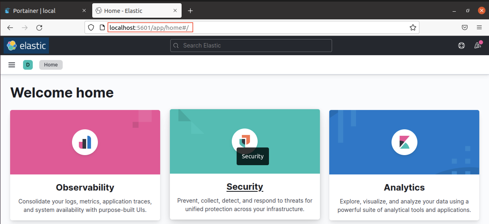
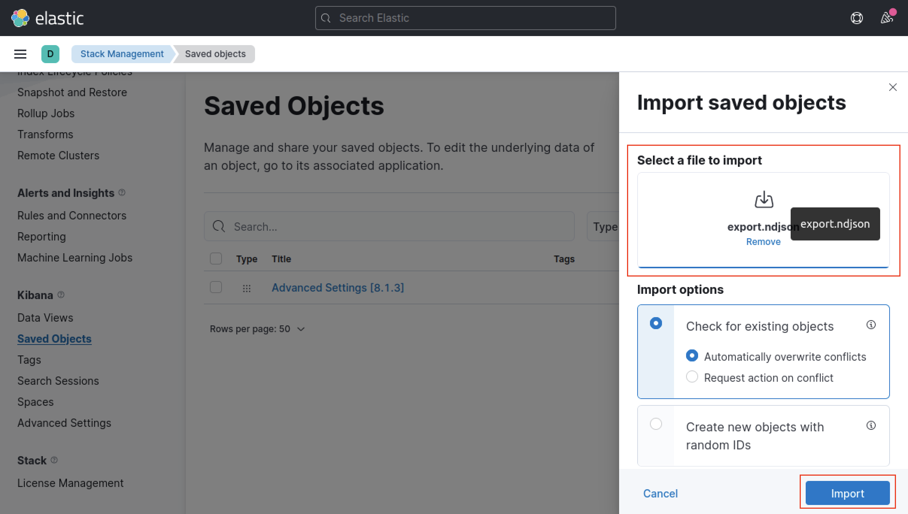
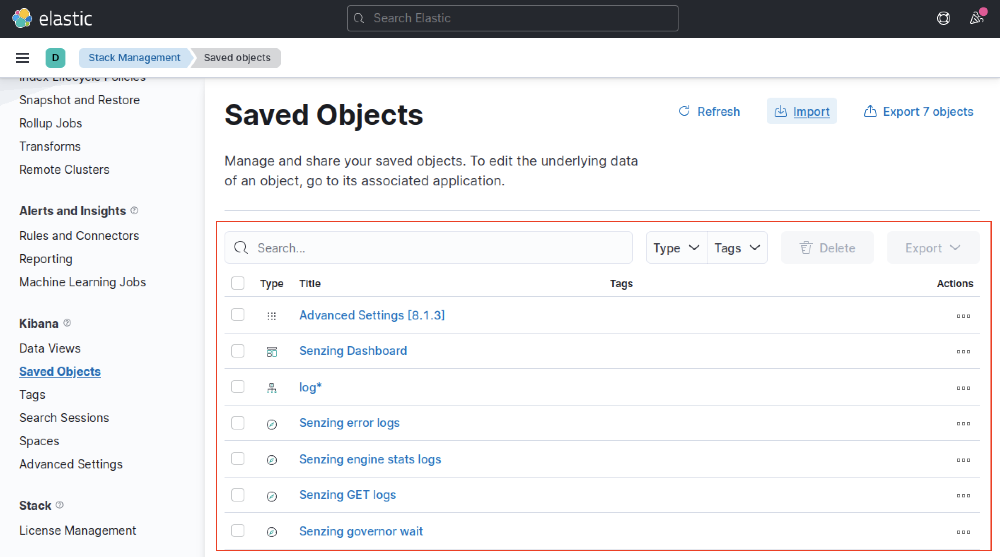
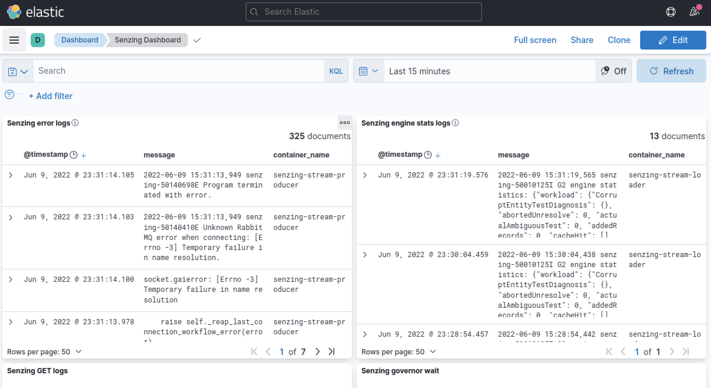
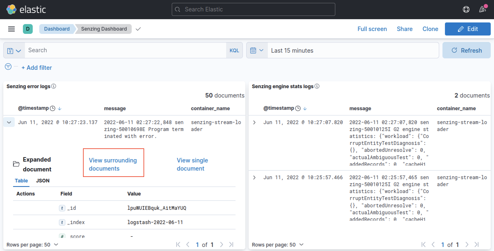
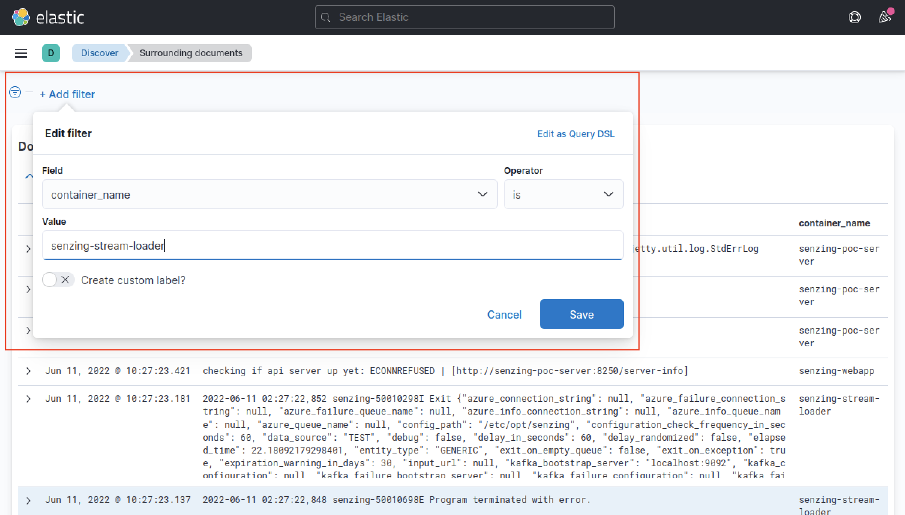
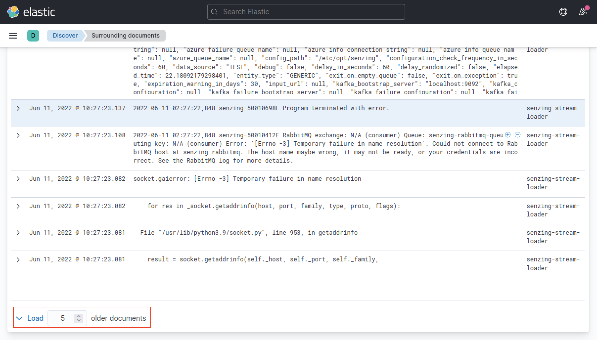

# Setup ELK on docker-compose

A quick guide on how to use the setup and use the ELK stack to sift through Senzing's logs.

## Contents

1. [Import Senzing dashboard on ELK stack](#Import-Senzing-dashboard-on-ELK-stack)
1. [View surrounding logs](#View-surrounding-logs)

## Import Senzing dashboard on ELK stack

1. Log in to Senzing Dashboard.
    1. Go to http://localhost:5601.
    1. Create kibana account.
    1. Log in with newly created kibana account.

    

1. Go to saved objects page.
    1. In the left-hand navigation bar, select "Stack Management".
    1. In the left-hand navigation bar, select "Saved Objects".
    1. In upper-right, click the "Import" button.

    

1. Import saved objects file
    1. In the import dialog box, select the "Select a file to import"
    1. select [export.ndjson](export.ndjson)
    1. In bottom-right, click the "Import" button.

    

1. Successful import.
    

1. View Senzing dashboard.
    1. In upper-left, click the "elastic" home button.
    1. In the dashboard menu, click on "Senzing Dashboard"
    

## View surrounding logs

1. View logs surrounding selected log 
    1. click on log row to expand it
    1. click "view surrounding documents"
    

1. Filter logs by container name
    1. In top-left, click the "+ Add filter" button.
    1. In the import dialog box, select "container_name" as the filter field
    1. Select "is" in the operator field
    1. Insert container name (e.g. senzing-stream-loader) into the value field
    1. In bottom-right, click the "Save" button.
    

1. Increase number of logs before/after selected log
    1. In top-left, click on the up arrow key to increase the logs see before
    
    1. In bottom-left, click on the up arrow key to increase the logs see before
    

