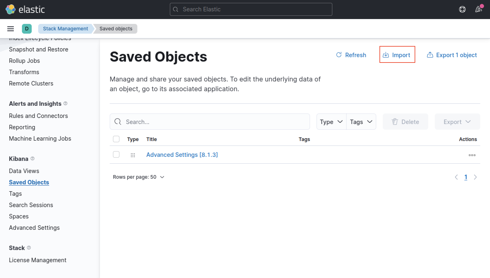

# How to setup ELK on docker-compose

## Setting up Senzing dashboard

first wait for kibana to be available to you and log in

go to stack management > saved objects and click import

select the export.ndjson as a file to import and click import

now you can see the import was successful as the objects are up

going to the dashboard page, you should see the following dashboard.

## how to look for a specific log before or after

click on any log row to expand it

click "view surrounding documents"

to only see the logs from a specific container, scroll to the top and click + add filter

for the filter field, select container_name

select the is operator

in the value field, insert the container name that you want to see and click save

you should now see the 5 logs that was recorded before and after the log you have chosen.

you can also increase the number of logs seen, by changing the number seen at the top.

