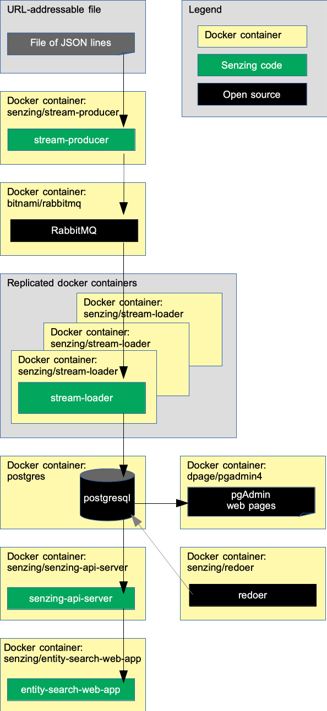

# docker-compose-rabbitmq-postgresql

## Synopsis

Using `docker-compose`, bring up a Senzing stack
using RabbitMQ and a PostgreSQL database.

## Overview

This repository illustrates a reference implementation of Senzing using
RabbitMQ as the queue and
PostgreSQL as the underlying database.

The instructions show how to set up a system that:

1. Reads JSON lines from a file on the internet and sends each JSON line to a message queue via the Senzing
   [stream-producer](https://github.com/Senzing/stream-producer).
    1. In this implementation, the queue is RabbitMQ.
1. Reads messages from the queue and inserts into Senzing via the Senzing
   [stream-loader](https://github.com/Senzing/stream-loader).
    1. In this implementation, Senzing keeps its data in a PostgreSQL database.
1. Reads information from Senzing via [Senzing API Server](https://github.com/Senzing/senzing-api-server) server.
1. Views resolved entities in a [web app](https://github.com/Senzing/entity-search-web-app).

The following diagram shows the relationship of the Docker containers in this Docker composition.
Arrows represent data flow.



### Contents

1. [Preamble](#preamble)
1. [Related artifacts](#related-artifacts)
1. [Expectations](#expectations)
1. [Prerequisites](#prerequisites)
1. [Demonstrate](#demonstrate)
    1. [View data](#view-data)
        1. [View docker containers](#view-docker-containers)
        1. [Use SSH](#use-ssh)
        1. [View RabbitMQ](#view-rabbitmq)
        1. [View PostgreSQL](#view-postgresql)
        1. [View Senzing API Server](#view-senzing-api-server)
        1. [View Senzing Entity Search WebApp](#view-senzing-entity-search-webapp)
        1. [View Jupyter notebooks](#view-jupyter-notebooks)
        1. [View X-Term](#view-x-term)
1. [Cleanup](#cleanup)
1. [Advanced](#advanced)
    1. [SSH port](#ssh-port)
    1. [Set sshd password](#set-sshd-password)
    1. [Docker images](#docker-images)
    1. [Configuration](#configuration)
1. [Errors](#errors)
1. [References](#references)

## Preamble

At [Senzing](http://senzing.com),
we strive to create GitHub documentation in a
"[don't make me think](https://github.com/Senzing/knowledge-base/blob/main/WHATIS/dont-make-me-think.md)" style.
For the most part, instructions are copy and paste.
Whenever thinking is needed, it's marked with a "thinking" icon :thinking:.
Whenever customization is needed, it's marked with a "pencil" icon :pencil2:.
If the instructions are not clear, please let us know by opening a new
[Documentation issue](https://github.com/Senzing/docker-compose-demo/issues/new?assignees=&labels=&template=documentation_request.md)
describing where we can improve.   Now on with the show...

### Legend

1. :thinking: - A "thinker" icon means that a little extra thinking may be required.
   Perhaps you'll need to make some choices.
   Perhaps it's an optional step.
1. :pencil2: - A "pencil" icon means that the instructions may need modification before performing.
1. :warning: - A "warning" icon means that something tricky is happening, so pay attention.

## Related artifacts

1. [DockerHub](https://hub.docker.com/r/senzing)

## Expectations

- **Space:** This repository and demonstration require 7 GB free disk space.
- **Time:** Budget 2 hours to get the demonstration up-and-running, depending on CPU and network speeds.
- **Background knowledge:** This repository assumes a working knowledge of:
  - [Docker](https://github.com/Senzing/knowledge-base/blob/main/WHATIS/docker.md)
  - [Docker-compose](https://github.com/Senzing/knowledge-base/blob/main/WHATIS/docker-compose.md)

## Prerequisites

1. [docker](https://github.com/Senzing/knowledge-base/blob/main/HOWTO/install-docker.md) -
   Minimum version: [20.10.16](https://docs.docker.com/engine/release-notes/#201016)
1. [docker-compose](https://github.com/Senzing/knowledge-base/blob/main/HOWTO/install-docker-compose.md) -
   Minimum version: [1.29.0](https://docs.docker.com/compose/release-notes/#1290)
1. [git](https://github.com/Senzing/knowledge-base/blob/main/HOWTO/install-git.md) -
   Minimum version: [2.25.0](https://github.com/git/git/tags)

## Demonstrate

1. :pencil2: Specify a new directory to hold demonstration artifacts on the local host.
   Example:

    ```console
    export SENZING_VOLUME=~/my-senzing
    ```

    1. :warning:
       **macOS** - [File sharing](https://github.com/Senzing/knowledge-base/blob/main/HOWTO/share-directories-with-docker.md#macos)
       must be enabled for `SENZING_VOLUME`.
    1. :warning:
       **Windows** - [File sharing](https://github.com/Senzing/knowledge-base/blob/main/HOWTO/share-directories-with-docker.md#windows)
       must be enabled for `SENZING_VOLUME`.

1. Set environment variables.
   Example:

    ```console
    export ELASTICSEARCH_DIR=${SENZING_VOLUME}/elasticsearch
    export PGADMIN_DIR=${SENZING_VOLUME}/pgadmin
    export POSTGRES_DIR=${SENZING_VOLUME}/postgres
    export RABBITMQ_DIR=${SENZING_VOLUME}/rabbitmq
    export SENZING_VAR_DIR=${SENZING_VOLUME}/var
    export SENZING_UID=$(id -u)
    export SENZING_GID=$(id -g)
    ```

1. Create directories.
   Example:

    ```console
    mkdir -p ${ELASTICSEARCH_DIR} ${PGADMIN_DIR} ${POSTGRES_DIR} ${RABBITMQ_DIR} ${SENZING_VAR_DIR}
    chmod -R 777 ${SENZING_VOLUME}
    ```

1. Get stable versions of Docker images.
   Example:

    ```console
    curl -X GET \
        --output ${SENZING_VOLUME}/docker-versions-stable.sh \
        https://raw.githubusercontent.com/Senzing/knowledge-base/main/lists/docker-versions-stable.sh
    source ${SENZING_VOLUME}/docker-versions-stable.sh
    ```

1. Download `docker-compose.yaml` and Docker images.
   Example:

    ```console
    curl -X GET \
        --output ${SENZING_VOLUME}/docker-compose.yaml \
        "https://raw.githubusercontent.com/Senzing/docker-compose-demo/main/resources/postgresql/docker-compose-rabbitmq-postgresql.yaml"
    cd ${SENZING_VOLUME}
    sudo --preserve-env docker-compose pull
    ```

1. Bring up Senzing docker-compose stack.
   Example:

    ```console
    cd ${SENZING_VOLUME}
    sudo --preserve-env docker-compose up
    ```

1. Allow time for the components to be downloaded, start, and initialize.
    1. There will be errors in some Docker logs as they wait for dependent services to become available.
       `docker-compose` isn't the best at orchestrating Docker container dependencies.

### View data

Once the docker-compose formation is running,
different aspects of the formation can be viewed.

Username and password for the following sites were either passed in as environment variables
or are the default values seen in
[docker-compose-rabbitmq-postgresql.yaml](../../resources/postgresql/docker-compose-rabbitmq-postgresql.yaml).

#### View Docker containers

1. A good tool to monitor individual Docker logs is
   [Portainer](https://github.com/Senzing/knowledge-base/blob/main/WHATIS/portainer.md).
   When running, Portainer is viewable at
   [localhost:9170](http://localhost:9170).

#### Use SSH

Instructions to use the senzing/sshd container are viewable in the [senzing/docker-sshd](https://github.com/Senzing/docker-sshd/blob/main/README.md#ssh-into-container) repository

#### View RabbitMQ

1. RabbitMQ is viewable at
   [localhost:15672](http://localhost:15672).
    1. **Defaults:** username: `user` password: `bitnami`
1. See
   [additional tips](https://github.com/Senzing/knowledge-base/blob/main/lists/docker-compose-demo-tips.md#rabbitmq)
   for working with RabbitMQ.

#### View PostgreSQL

1. PostgreSQL is viewable at
   [localhost:9171](http://localhost:9171).
    1. **Database defaults:** username: `postgres` password: `postgres`
1. See
   [additional tips](https://github.com/Senzing/knowledge-base/blob/main/lists/docker-compose-demo-tips.md#postgresql)
   for working with PostgreSQL.

#### View Senzing API Server

View results from Senzing REST API server.
The server supports the
[Senzing REST API](https://github.com/Senzing/senzing-rest-api-specification).

1. The
   [OpenApi Editor](https://petstore.swagger.io/?url=https://raw.githubusercontent.com/Senzing/senzing-rest-api-specification/main/senzing-rest-api.yaml)
   with **Servers** value of [http://localhost:8250](http://localhost:8250)
   can be used to try the Senzing REST API.
1. Example Senzing REST API request:
   [localhost:8250/heartbeat](http://localhost:8250/heartbeat)
1. See
   [additional tips](https://github.com/Senzing/knowledge-base/blob/main/lists/docker-compose-demo-tips.md#senzing-api-server)
   for working with Senzing API server.

#### View Senzing Entity Search WebApp

1. Senzing Entity Search WebApp is viewable at
   [localhost:8251](http://localhost:8251).
1. See
   [additional tips](https://github.com/Senzing/knowledge-base/blob/main/lists/docker-compose-demo-tips.md#senzing-entity-search-webapp)
   for working with Senzing Entity Search WebApp.

#### View Jupyter notebooks

1. Change file permissions on database files.
   Example:

    ```console
    sudo chmod 777 -R ${POSTGRES_DIR}
    ```

1. Jupyter Notebooks are viewable at
   [localhost:9178](http://localhost:9178).
1. See
   [additional tips](https://github.com/Senzing/knowledge-base/blob/main/lists/docker-compose-demo-tips.md#jupyter-notebooks)
   for working with Jupyter Notebooks.

#### View X-Term

The web-based Senzing X-term can be used to run Senzing command-line programs.

1. Senzing X-term is viewable at
   [localhost:8254](http://localhost:8254).
1. See
   [additional tips](https://github.com/Senzing/knowledge-base/blob/main/lists/docker-compose-demo-tips.md#senzing-x-term)
   for working with Senzing X-Term.

## Cleanup

When the docker-compose formation is no longer needed,
it can be brought down and directories can be deleted.

1. Bring down Docker formation.
   Example:

    ```console
    cd ${SENZING_VOLUME}
    sudo docker-compose down
    ```

1. Remove directories from host system.
   The following directory was created during the demonstration:
    1. `${SENZING_VOLUME}`

   It may be safely deleted.

## Advanced

The following topics discuss variations to the basic docker-compose demonstration.

### SSH port

:thinking: **Optional:**
If you do not plan on using the senzing/sshd container then these ssh sections can be ignored.
Normally port 22 is already in use for `ssh`.
So a different port may be needed by the running docker container.

1. :thinking: See if port 22 is already in use.
   If it is not in use, the next 2 steps are optional.
   Example:

    ```console
    sudo lsof -i -P -n | grep LISTEN | grep :22
    ````

1. :pencil2: Choose port for docker container.
   Example:

    ```console
    export SENZING_SSHD_PORT=9181
    ```

1. Construct parameter for `docker run`.
   Example:

    ```console
    export SENZING_SSHD_PORT_PARAMETER="--publish ${SENZING_SSHD_PORT:-9181}:22"
    ```

### Set sshd password

:thinking: **Optional:** The default password set for the sshd containers is `senzingsshdpassword`.
However, this can be changed.

1. :pencil2: Set the `SENZING_SSHD_PASSWORD` variable to change the password to access the sshd container.
   Example:

    ```console
    export SENZING_SSHD_PASSWORD=<Pass_You_Want>
    ```

### Docker images

This docker formation brings up the following docker containers:

1. *[bitnami/rabbitmq](https://github.com/bitnami/bitnami-docker-rabbitmq)*
1. *[dpage/pgadmin4](https://hub.docker.com/r/dpage/pgadmin4)*
1. *[postgres](https://hub.docker.com/_/postgres)*
1. *[senzing/console](https://github.com/Senzing/docker-senzing-console)*
1. *[senzing/entity-web-search-app](https://github.com/Senzing/entity-search-web-app)*
1. *[senzing/init-container](https://github.com/Senzing/docker-init-container)*
1. *[senzing/jupyter](https://github.com/Senzing/docker-jupyter)*
1. *[senzing/redoer](https://github.com/Senzing/redoer)*
1. *[senzing/senzing-api-server](https://github.com/Senzing/senzing-api-server)*
1. *[senzing/stream-loader](https://github.com/Senzing/stream-loader)*
1. *[senzing/stream-producer](https://github.com/Senzing/stream-producer)*

### Configuration

Configuration values specified by environment variable or command line parameter.

- **[POSTGRES_DIR](https://github.com/Senzing/knowledge-base/blob/main/lists/environment-variables.md#postgres_dir)**
- **[RABBITMQ_DIR](https://github.com/Senzing/knowledge-base/blob/main/lists/environment-variables.md#rabbitmq_dir)**
- **[SENZING_VAR_DIR](https://github.com/Senzing/knowledge-base/blob/main/lists/environment-variables.md#senzing_var_dir)**

## Errors

1. See [docs/errors.md](docs/errors.md).

## References
